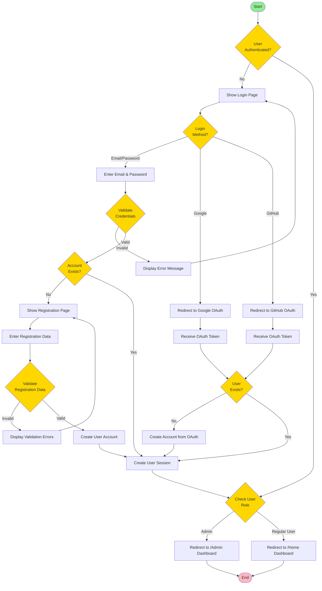
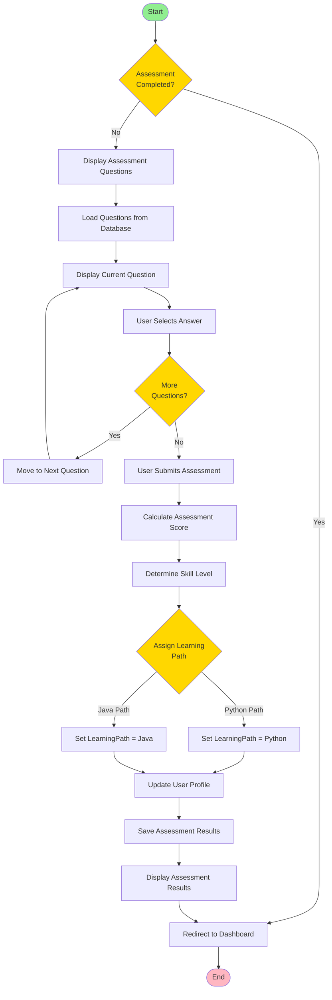
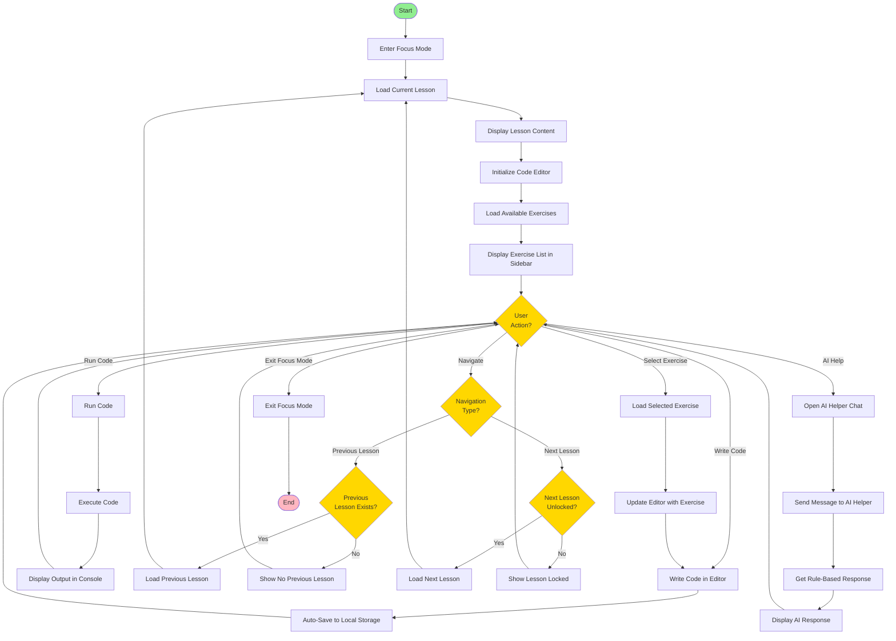
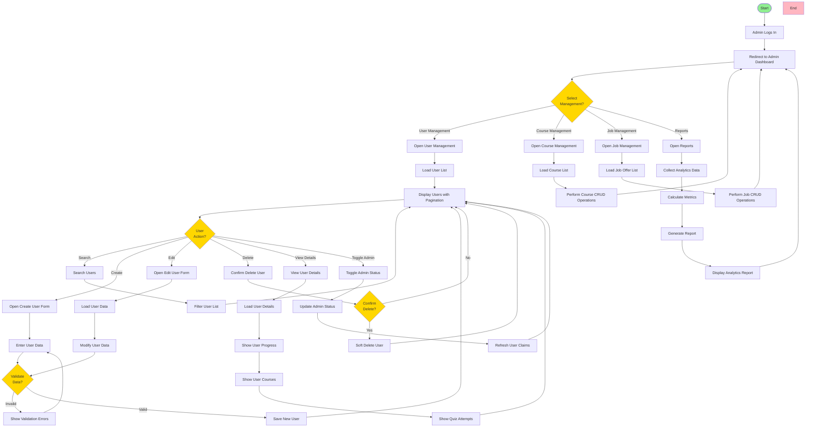
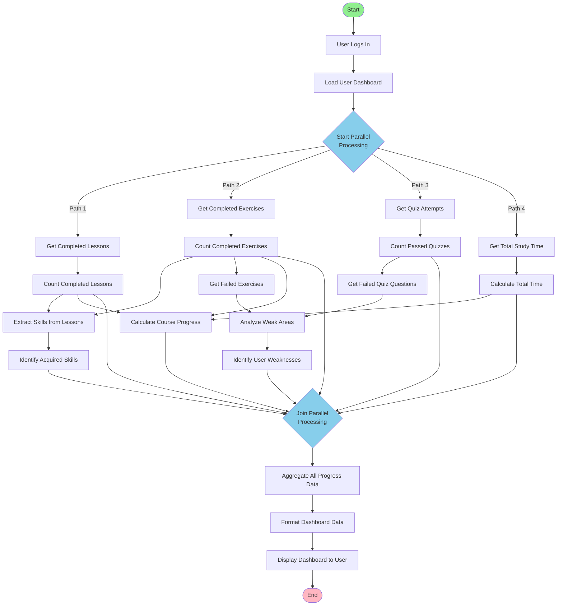
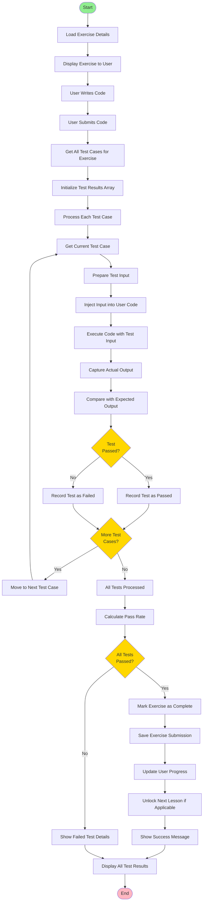

```mermaid
flowchart TD
    Start([Start]) --> ViewDashboard[View User Dashboard]
    ViewDashboard --> BrowseCourses[Browse Available Courses]
    BrowseCourses --> SelectCourse[Select Course]
    SelectCourse --> CheckEnrollment{Enrolled<br/>in Course?}
    
    CheckEnrollment -->|No| AutoEnroll[Auto-Enroll User in Course]
    CheckEnrollment -->|Yes| LoadCourse[Load Course Content]
    AutoEnroll --> LoadCourse
    
    LoadCourse --> DisplayLessons[Display Lesson List]
    DisplayLessons --> SelectLesson[User Selects Lesson]
    SelectLesson --> CheckPrerequisites{Previous Lesson<br/>Completed?}
    
    CheckPrerequisites -->|No| ShowLocked[Show Lesson Locked Message]
    CheckPrerequisites -->|Yes| LoadLesson[Load Lesson Content]
    ShowLocked --> DisplayLessons
    
    LoadLesson --> DisplayContent[Display Lesson Content]
    DisplayContent --> ViewExercises[View Coding Exercises]
    ViewExercises --> SelectExercise{Select<br/>Exercise?}
    
    SelectExercise -->|Yes| LoadExercise[Load Exercise Details]
    SelectExercise -->|No| ContinueReading[Continue Reading Lesson]
    
    LoadExercise --> WriteCode[Write Code in Editor]
    ContinueReading --> MarkComplete{Mark Lesson<br/>Complete?}
    
    WriteCode --> RunCode[Run Code]
    RunCode --> ExecuteCode[Execute Code in Docker]
    ExecuteCode --> DisplayOutput[Display Output]
    DisplayOutput --> SubmitExercise{Submit<br/>Exercise?}
    
    SubmitExercise -->|No| WriteCode
    SubmitExercise -->|Yes| ValidateCode[Validate Against Test Cases]
    ValidateCode --> AllTestsPass{All Tests<br/>Pass?}
    
    AllTestsPass -->|No| ShowFailures[Show Failed Test Cases]
    ShowFailures --> WriteCode
    
    AllTestsPass -->|Yes| SaveSubmission[Save Exercise Submission]
    SaveSubmission --> UnlockNext[Unlock Next Lesson]
    UnlockNext --> MarkComplete
    
    MarkComplete --> SaveCompletion[Save Lesson Completion]
    SaveCompletion --> UpdateProgress[Update Course Progress]
    UpdateProgress --> CheckMoreLessons{More<br/>Lessons?}
    
    CheckMoreLessons -->|Yes| DisplayLessons
    CheckMoreLessons -->|No| CourseComplete[Course Completed]
    CourseComplete --> End([End])
    
    style Start fill:#90EE90
    style End fill:#FFB6C1
    style CheckEnrollment fill:#FFD700
    style CheckPrerequisites fill:#FFD700
    style SelectExercise fill:#FFD700
    style SubmitExercise fill:#FFD700
    style AllTestsPass fill:#FFD700
    style MarkComplete fill:#FFD700
    style CheckMoreLessons fill:#FFD700
```

```mermaid
flowchart TD
    Start([Start]) --> ReceiveCode[Receive User Code]
    ReceiveCode --> CheckExercise{Exercise<br/>Selected?}
    
    CheckExercise -->|Yes| LoadExercise[Load Exercise Details]
    CheckExercise -->|No| ExperimentMode[Enter Experiment Mode]
    
    LoadExercise --> GetTestCases[Get Exercise Test Cases]
    GetTestCases --> DetectLanguage[Detect Programming Language]
    ExperimentMode --> DetectLanguageFromCourse[Detect Language from Course]
    
    DetectLanguage --> PrepareCode[Prepare Code for Execution]
    DetectLanguageFromCourse --> PrepareCode
    
    PrepareCode --> InjectInput{Need Input<br/>Injection?}
    InjectInput -->|Yes| InjectTestInput[Inject Test Input into Code]
    InjectInput -->|No| SendToRunner[Send Code to Code Runner]
    InjectTestInput --> SendToRunner
    
    SendToRunner --> SelectRunner{Runner<br/>Type?}
    SelectRunner -->|Python| RunPython[Execute Python Code]
    SelectRunner -->|Java| RunJava[Execute Java Code]
    
    RunPython --> CaptureOutput[Capture Output & Errors]
    RunJava --> CaptureOutput
    
    CaptureOutput --> CheckExercise2{Exercise<br/>Selected?}
    CheckExercise2 -->|No| DisplayOutput[Display Output to User]
    CheckExercise2 -->|Yes| ValidateOutput[Validate Output Against Tests]
    
    DisplayOutput --> End([End])
    
    ValidateOutput --> CompareResults[Compare with Expected Output]
    CompareResults --> TestResult{Test<br/>Passed?}
    
    TestResult -->|No| LogFailure[Log Failed Test]
    TestResult -->|Yes| LogSuccess[Log Passed Test]
    
    LogFailure --> MoreTests{More Test<br/>Cases?}
    LogSuccess --> MoreTests
    
    MoreTests -->|Yes| NextTest[Process Next Test Case]
    NextTest --> ValidateOutput
    
    MoreTests -->|No| AllPassed{All Tests<br/>Passed?}
    AllPassed -->|No| ShowResults[Show Test Results]
    AllPassed -->|Yes| SaveSubmission[Save Exercise Submission]
    
    SaveSubmission --> MarkComplete[Mark Exercise Complete]
    MarkComplete --> UnlockLesson[Unlock Next Lesson]
    UnlockLesson --> ShowResults
    
    ShowResults --> End
    
    style Start fill:#90EE90
    style End fill:#FFB6C1
    style CheckExercise fill:#FFD700
    style InjectInput fill:#FFD700
    style SelectRunner fill:#FFD700
    style CheckExercise2 fill:#FFD700
    style TestResult fill:#FFD700
    style MoreTests fill:#FFD700
    style AllPassed fill:#FFD700
```

```mermaid
flowchart TD
    Start([Start]) --> CheckEligibility[Check User Eligibility]
    CheckEligibility --> GetCompletedLessons[Get User's Completed Lessons]
    GetCompletedLessons --> FilterQuizzes[Filter Available Quizzes]
    FilterQuizzes --> DisplayQuizzes[Display Available Quizzes]
    DisplayQuizzes --> SelectQuiz[User Selects Quiz]
    
    SelectQuiz --> LoadQuiz[Load Quiz Questions]
    LoadQuiz --> CheckTimeLimit{Has Time<br/>Limit?}
    
    CheckTimeLimit -->|Yes| StartTimer[Start Quiz Timer]
    CheckTimeLimit -->|No| DisplayQuestions[Display Quiz Questions]
    StartTimer --> DisplayQuestions
    
    DisplayQuestions --> AnswerQuestion[User Answers Question]
    AnswerQuestion --> CheckMoreQuestions{More<br/>Questions?}
    
    CheckMoreQuestions -->|Yes| NextQuestion[Move to Next Question]
    NextQuestion --> AnswerQuestion
    
    CheckMoreQuestions -->|No| SubmitQuiz{Submit<br/>Quiz?}
    SubmitQuiz -->|No| AnswerQuestion
    
    SubmitQuiz -->|Yes| StopTimer[Stop Timer]
    StopTimer --> CalculateScore[Calculate Quiz Score]
    CalculateScore --> CheckPassing{Score >=<br/>Passing Score?}
    
    CheckPassing -->|Yes| MarkPassed[Mark as Passed]
    CheckPassing -->|No| MarkFailed[Mark as Failed]
    
    MarkPassed --> SaveAttempt[Save Quiz Attempt]
    MarkFailed --> SaveAttempt
    
    SaveAttempt --> SaveAnswers[Save User Answers]
    SaveAnswers --> GenerateResults[Generate Results Summary]
    GenerateResults --> DisplayResults[Display Quiz Results]
    
    DisplayResults --> ShowCorrectAnswers[Show Correct/Incorrect Answers]
    ShowCorrectAnswers --> ShowFeedback[Show Feedback for Each Question]
    ShowFeedback --> UpdateProgress[Update User Progress]
    UpdateProgress --> End([End])
    
    style Start fill:#90EE90
    style End fill:#FFB6C1
    style CheckTimeLimit fill:#FFD700
    style CheckMoreQuestions fill:#FFD700
    style SubmitQuiz fill:#FFD700
    style CheckPassing fill:#FFD700
```

# Activity Diagrams
## CodeWave Learning Platform

**Version:** 1.0  
**Date:** December 2024

---

## Table of Contents

1. [Overview](#overview)
2. [Activity Diagram Notation](#activity-diagram-notation)
3. [Activity Diagrams](#activity-diagrams)
4. [Workflow Descriptions](#workflow-descriptions)

---

## Overview

Activity Diagrams illustrate the flow of control and activities in the CodeWave system. They show sequential and parallel activities, decision points, and the overall workflow of business processes.

### Purpose
- Visualize business workflows
- Show activity sequences and parallel processes
- Document decision points and conditions
- Support process understanding and optimization

---

## Activity Diagram Notation

### Symbols Used

- **Activity**: Rounded rectangle - Represents an action or task
- **Start Node**: Filled circle - Initial state
- **End Node**: Filled circle with border - Final state
- **Decision Node**: Diamond - Represents a decision point
- **Merge Node**: Diamond - Merges multiple flows
- **Fork Node**: Horizontal bar - Splits flow into parallel activities
- **Join Node**: Horizontal bar - Synchronizes parallel flows
- **Swimlanes**: Vertical/horizontal partitions - Organize activities by actor
- **Flow**: Arrow - Shows control flow direction

---

## Activity Diagrams

### AD1: User Registration and Login Flow

---

### AD2: Assessment and Learning Path Assignment Flow

---

### AD3: Course Learning Flow

---

### AD4: Code Execution Flow

---

### AD5: Quiz Taking Flow

---

### AD6: Focus Mode Lesson Flow

---

### AD7: Admin User Management Flow

---

### AD8: Progress Tracking Flow

---

### AD9: Exercise Submission and Validation Flow

---

## Workflow Descriptions

### AD1: User Registration and Login Flow
**Purpose**: Handles user authentication through multiple methods  
**Key Activities**:
- Email/password authentication
- OAuth authentication (Google, GitHub)
- Account creation
- Session management
- Role-based redirection

**Decision Points**:
- Authentication method selection
- Account existence check
- Credential validation
- User role determination

---

### AD2: Assessment and Learning Path Assignment Flow
**Purpose**: Guides new users through assessment and assigns learning path  
**Key Activities**:
- Question presentation
- Answer collection
- Score calculation
- Learning path assignment
- Profile update

**Decision Points**:
- Assessment completion check
- Learning path selection (Python/Java)

---

### AD3: Course Learning Flow
**Purpose**: Complete learning workflow from course selection to completion  
**Key Activities**:
- Course browsing and enrollment
- Lesson access with prerequisites
- Exercise solving
- Code execution and validation
- Progress tracking

**Decision Points**:
- Enrollment status
- Prerequisite completion
- Exercise selection
- Test case validation
- Lesson completion

---

### AD4: Code Execution Flow
**Purpose**: Execute user code and validate against test cases  
**Key Activities**:
- Language detection
- Code preparation
- Input injection
- Code execution
- Output validation

**Decision Points**:
- Exercise selection
- Language type
- Input injection need
- Test case validation

---

### AD5: Quiz Taking Flow
**Purpose**: Complete quiz workflow from selection to results  
**Key Activities**:
- Quiz eligibility check
- Question presentation
- Answer collection
- Score calculation
- Results display

**Decision Points**:
- Time limit check
- Question completion
- Passing score validation

---

### AD6: Focus Mode Lesson Flow
**Purpose**: Distraction-free learning environment with code editor  
**Key Activities**:
- Lesson content display
- Code editor management
- Exercise selection
- Code execution
- Navigation between lessons
- AI helper interaction

**Decision Points**:
- User action selection
- Navigation direction
- Lesson availability

---

### AD7: Admin User Management Flow
**Purpose**: Complete admin workflow for managing platform content  
**Key Activities**:
- User management (CRUD)
- Course management
- Job offer management
- Report generation

**Decision Points**:
- Management type selection
- User action selection
- Data validation
- Delete confirmation

---

### AD8: Progress Tracking Flow
**Purpose**: Calculate and display user progress metrics  
**Key Activities**:
- Parallel data collection
- Statistics calculation
- Skills extraction
- Weakness identification
- Dashboard generation

**Parallel Processing**:
- Lesson completion counting
- Exercise completion counting
- Quiz attempt analysis
- Study time calculation

---

### AD9: Exercise Submission and Validation Flow
**Purpose**: Validate user code against multiple test cases  
**Key Activities**:
- Test case retrieval
- Sequential test execution
- Output comparison
- Result aggregation
- Progress update

**Decision Points**:
- Individual test pass/fail
- All tests completion
- Overall validation result

---

## Activity Diagram Summary

| Diagram | Focus Area | Key Activities | Decision Points |
|---------|------------|----------------|----------------|
| AD1 | Authentication | Login, Registration, OAuth | 7 |
| AD2 | Assessment | Question answering, Path assignment | 3 |
| AD3 | Learning | Course access, Exercise solving | 7 |
| AD4 | Code Execution | Code running, Validation | 6 |
| AD5 | Quiz System | Quiz taking, Scoring | 4 |
| AD6 | Focus Mode | Lesson viewing, Code editing | 4 |
| AD7 | Admin Management | CRUD operations, Reports | 5 |
| AD8 | Progress Tracking | Statistics calculation | 1 (parallel) |
| AD9 | Exercise Validation | Test case validation | 3 |

---

## Key Patterns Identified

### Sequential Flow
- Most activities follow sequential execution
- Clear start and end points
- Linear progression through workflows

### Decision-Based Flow
- Multiple decision points guide flow
- Conditional branching based on user/system state
- Error handling through alternative paths

### Parallel Processing
- Progress tracking uses parallel data collection
- Multiple metrics calculated simultaneously
- Synchronized aggregation at join points

### Loop Patterns
- Question iteration in assessments and quizzes
- Test case iteration in code validation
- Lesson progression in course learning

---

**End of Document**

