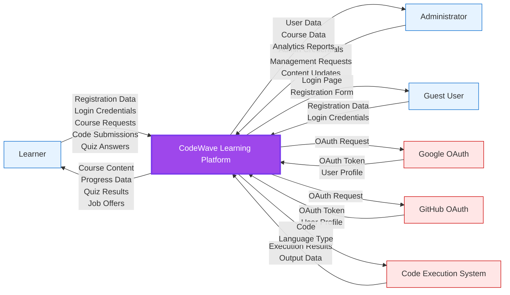
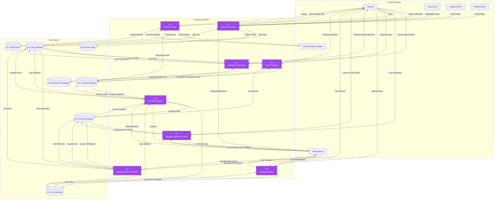
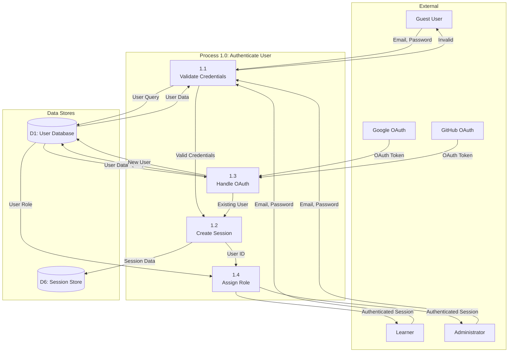
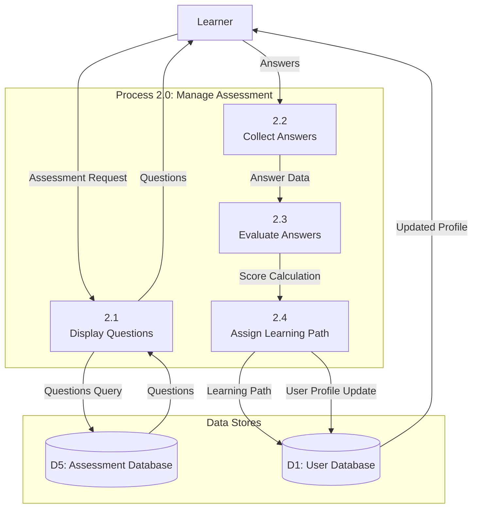
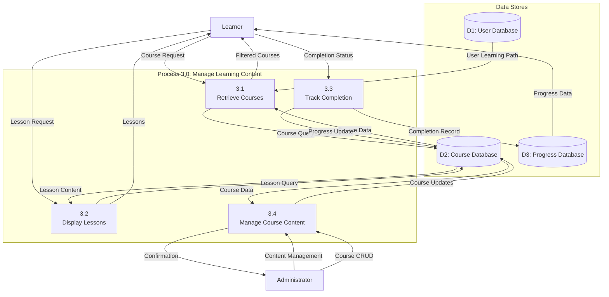
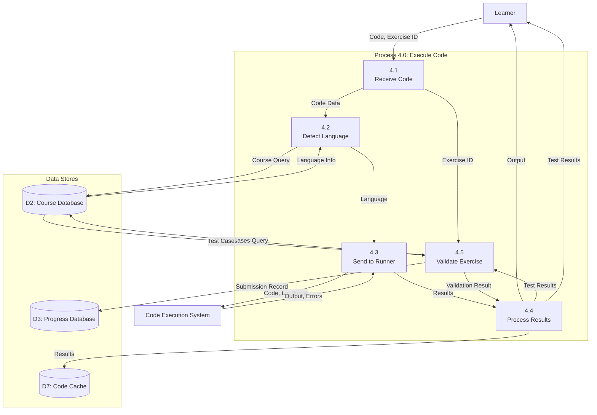
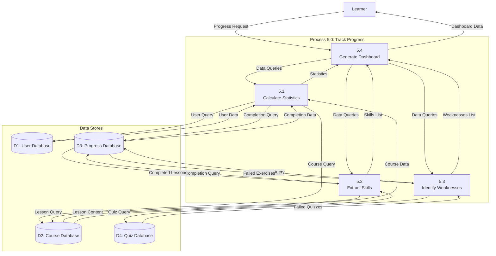
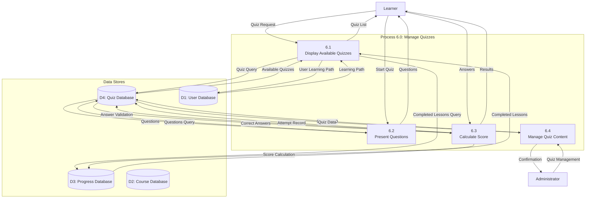
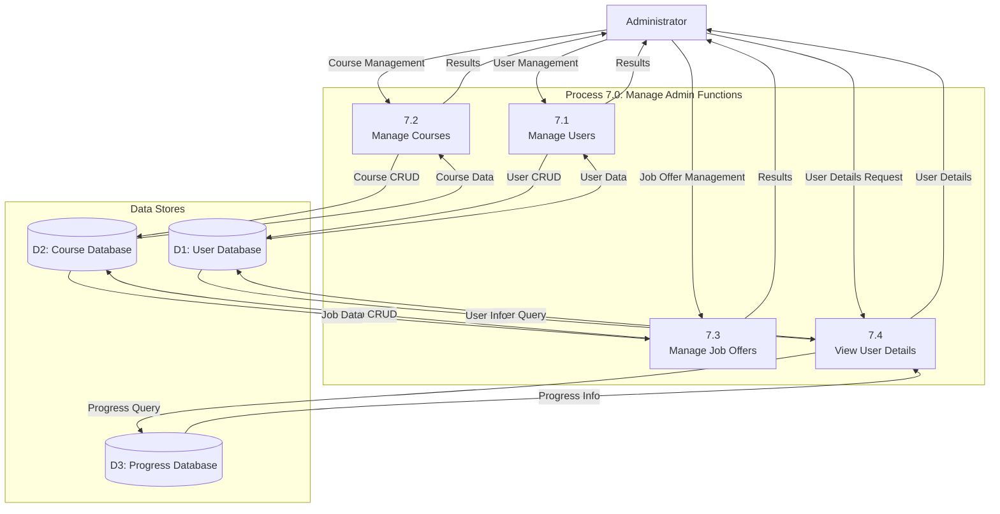
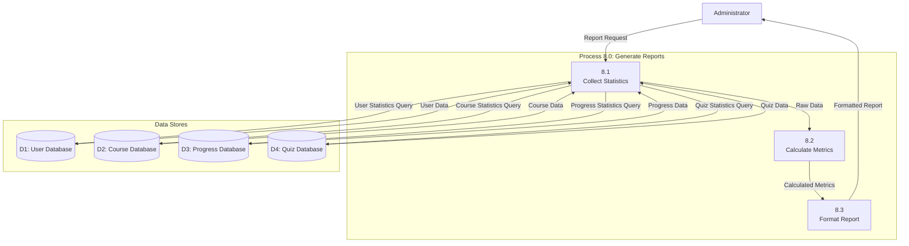

# Data Flow Diagrams (DFD)
## CodeWave Learning Platform

**Version:** 1.0  
**Date:** December 2024

---

## Table of Contents

1. [Overview](#overview)
2. [DFD Notation](#dfd-notation)
3. [Context Diagram (Level 0)](#context-diagram-level-0)
4. [Level 1 DFD](#level-1-dfd)
5. [Level 2 DFDs](#level-2-dfds)
6. [Data Dictionary](#data-dictionary)

---

## Overview

Data Flow Diagrams (DFD) illustrate how data moves through the CodeWave system. They show processes, data stores, external entities, and the data flows between them.

### Purpose
- Visualize data flow through the system
- Identify system boundaries
- Document data transformations
- Support system design and analysis

---

## DFD Notation

### Symbols Used

- **Process**: Rounded rectangle - Represents a function that transforms data
- **External Entity**: Rectangle - Represents external actors or systems
- **Data Store**: Open rectangle (two parallel lines) - Represents data storage
- **Data Flow**: Arrow - Represents data movement with label

### Naming Conventions

- **Processes**: Verb + Noun (e.g., "Authenticate User", "Execute Code")
- **Data Stores**: Noun (e.g., "User Database", "Session Store")
- **External Entities**: Noun (e.g., "Learner", "Administrator")
- **Data Flows**: Noun phrases (e.g., "User Credentials", "Course Data")

---

## Context Diagram (Level 0)

The context diagram shows the system as a single process and its interactions with external entities.

---

## Level 1 DFD

Level 1 DFD decomposes the system into major processes and shows data stores.

---

## Level 2 DFDs

### DFD 1.0: Authenticate User

### DFD 2.0: Manage Assessment

### DFD 3.0: Manage Learning Content

### DFD 4.0: Execute Code

### DFD 5.0: Track Progress

### DFD 6.0: Manage Quizzes

### DFD 7.0: Manage Admin Functions

### DFD 8.0: Generate Reports

---

## Data Dictionary

### Data Stores

#### D1: User Database
- **Description**: Stores all user account information and profiles
- **Contents**:
  - User credentials (email, password hash)
  - User profile (firstName, lastName, level, learningPath)
  - User preferences and onboarding data
  - Admin status flag
- **Access**: Read/Write by authentication, assessment, progress, admin processes

#### D2: Course Database
- **Description**: Stores learning content including courses, lessons, exercises, and job offers
- **Contents**:
  - Courses (title, description, difficulty, learningPath, programmingLanguage)
  - Lessons (title, content, orderNumber, courseId)
  - CodingExercises (title, description, starterCode, expectedOutput)
  - ExerciseTestCases (input, expectedOutput, orderNumber)
  - JobOffers (jobTitle, company, description, requiredSkills, deadline)
- **Access**: Read/Write by learning content, code execution, admin processes

#### D3: Progress Database
- **Description**: Tracks user progress and submissions
- **Contents**:
  - LessonCompletions (userId, lessonId, completionDate, timeSpentMinutes)
  - ExerciseSubmissions (userId, exerciseId, submittedCode, output, isCorrect)
  - UserCourses (userId, courseId, progressPercent, completionDate)
- **Access**: Read/Write by progress tracking, learning content, code execution processes

#### D4: Quiz Database
- **Description**: Stores quiz content and user attempts
- **Contents**:
  - Quizzes (title, description, timeLimitMinutes, passingScore, courseId)
  - QuizQuestions (text, difficulty, orderNumber, quizId)
  - QuizAnswerOptions (text, isCorrect, quizQuestionId)
  - UserQuizAttempts (userId, quizId, score, isPassed, timeSpentMinutes)
  - UserQuizAnswers (userQuizAttemptId, quizQuestionId, selectedAnswerOptionId, isCorrect)
- **Access**: Read/Write by quiz management, progress tracking processes

#### D5: Assessment Database
- **Description**: Stores initial assessment questions and user responses
- **Contents**:
  - Assessments (title)
  - Questions (text, difficulty, assessmentId)
  - AnswerOptions (text, isCorrect, questionId)
  - UserAssessments (userId, assessmentId, score, resultLevel, assignedLearningPath)
  - UserAnswers (userAssessmentId, questionId, answerOptionId, isCorrect)
- **Access**: Read/Write by assessment management process

#### D6: Session Store
- **Description**: Temporary storage for user sessions
- **Contents**:
  - Session ID
  - User ID
  - Session expiration time
  - Authentication tokens
- **Access**: Read/Write by authentication process

#### D7: Code Cache
- **Description**: Temporary storage for code execution results
- **Contents**:
  - Code hash
  - Execution results
  - Output data
  - Cache expiration time
- **Access**: Read/Write by code execution process

### Data Flows

#### Authentication Flows
- **Login Credentials**: Email, Password → Process 1.0
- **Registration Data**: Email, Password, FirstName, LastName → Process 1.0
- **OAuth Token**: Authentication token from Google/GitHub → Process 1.0
- **User Profile**: User information from OAuth provider → Process 1.0
- **Authenticated Session**: Session ID, User ID, Role → External Entities

#### Learning Content Flows
- **Course Request**: Learning path filter → Process 3.0
- **Course Data**: Course list with details → Learner
- **Lesson Request**: Lesson ID → Process 3.0
- **Lesson Content**: Lesson text, code examples, exercises → Learner
- **Completion Status**: Lesson ID, completion flag → Process 3.0

#### Code Execution Flows
- **Code**: User-written code, Exercise ID (optional) → Process 4.0
- **Language Type**: Python or Java → Code Execution System
- **Execution Results**: Output, errors, execution time → Process 4.0
- **Test Results**: Pass/fail status, test case details → Learner

#### Progress Flows
- **Progress Query**: User ID → Process 5.0
- **Progress Statistics**: Completed lessons, exercises, quizzes, study time → Learner
- **Skills List**: Extracted skills from completed content → Learner
- **Weaknesses List**: Topics with low performance → Learner

#### Quiz Flows
- **Quiz Request**: User ID, completed lessons → Process 6.0
- **Available Quizzes**: Quiz list filtered by progress → Learner
- **Quiz Answers**: Selected answer options → Process 6.0
- **Quiz Results**: Score, pass/fail, detailed feedback → Learner

#### Admin Flows
- **Management Requests**: CRUD operations → Process 7.0
- **User Data**: User list, user details → Administrator
- **Course Data**: Course list, course details → Administrator
- **Analytics Data**: Statistics, metrics → Process 8.0
- **Reports**: Formatted analytics report → Administrator

---

## Process Descriptions

### 1.0 Authenticate User
- **Input**: Login credentials, OAuth tokens
- **Output**: Authenticated session, user role
- **Function**: Validates user credentials, creates session, assigns role-based access

### 2.0 Manage Assessment
- **Input**: Assessment answers
- **Output**: Learning path assignment, user profile update
- **Function**: Evaluates answers, calculates score, assigns learning path

### 3.0 Manage Learning Content
- **Input**: Course requests, content management requests
- **Output**: Course content, lesson materials, completion confirmations
- **Function**: Retrieves and displays learning content, tracks completions

### 4.0 Execute Code
- **Input**: User code, exercise ID (optional)
- **Output**: Execution results, test validation results
- **Function**: Executes code in isolated environment, validates against test cases

### 5.0 Track Progress
- **Input**: Progress queries
- **Output**: Progress statistics, skills, weaknesses
- **Function**: Calculates and aggregates user progress metrics

### 6.0 Manage Quizzes
- **Input**: Quiz requests, quiz answers, quiz management
- **Output**: Available quizzes, quiz questions, quiz results
- **Function**: Displays quizzes, collects answers, calculates scores

### 7.0 Manage Admin Functions
- **Input**: Admin management requests
- **Output**: Management results, user/course data
- **Function**: Performs CRUD operations on users, courses, job offers

### 8.0 Generate Reports
- **Input**: Report requests
- **Output**: Analytics reports
- **Function**: Collects statistics, calculates metrics, formats reports

---

## Data Flow Summary

### Input Flows (External → System)
- User registration data
- Login credentials
- OAuth tokens
- Course requests
- Code submissions
- Quiz answers
- Assessment answers
- Admin management requests

### Output Flows (System → External)
- Authenticated sessions
- Course content
- Lesson materials
- Code execution results
- Progress statistics
- Quiz results
- Assessment results
- Management confirmations
- Analytics reports

### Internal Flows (Process → Data Store)
- User data storage/retrieval
- Course data storage/retrieval
- Progress data storage/retrieval
- Quiz data storage/retrieval
- Assessment data storage/retrieval
- Session data storage/retrieval
- Code cache storage/retrieval

---

**End of Document**

