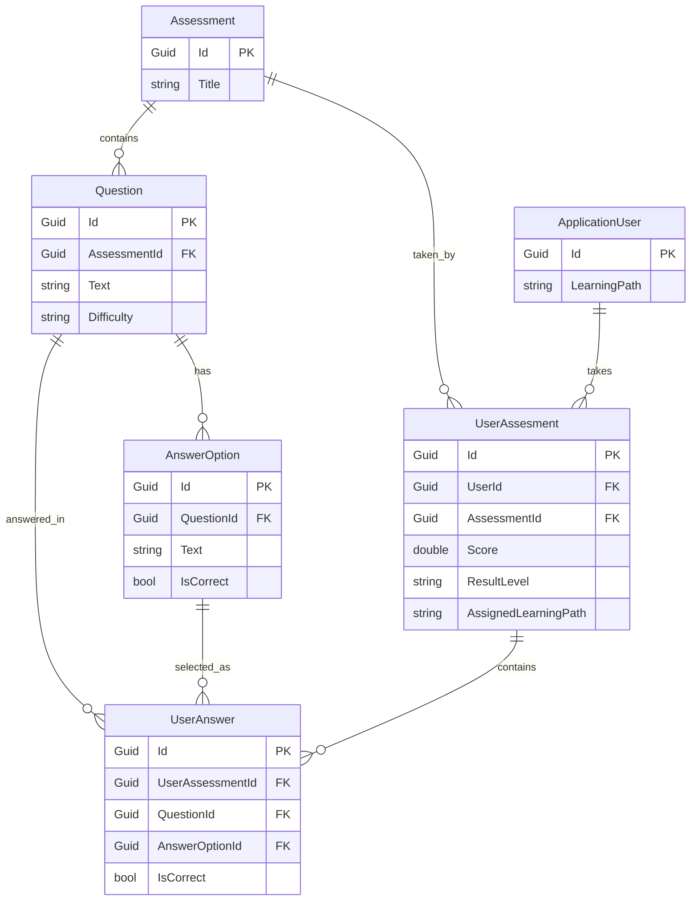
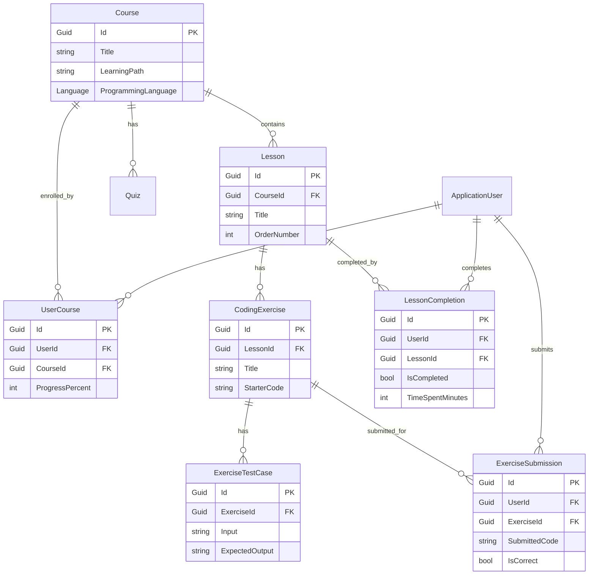
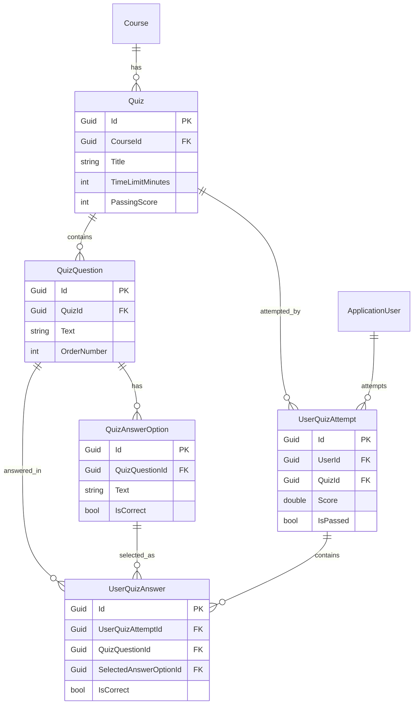
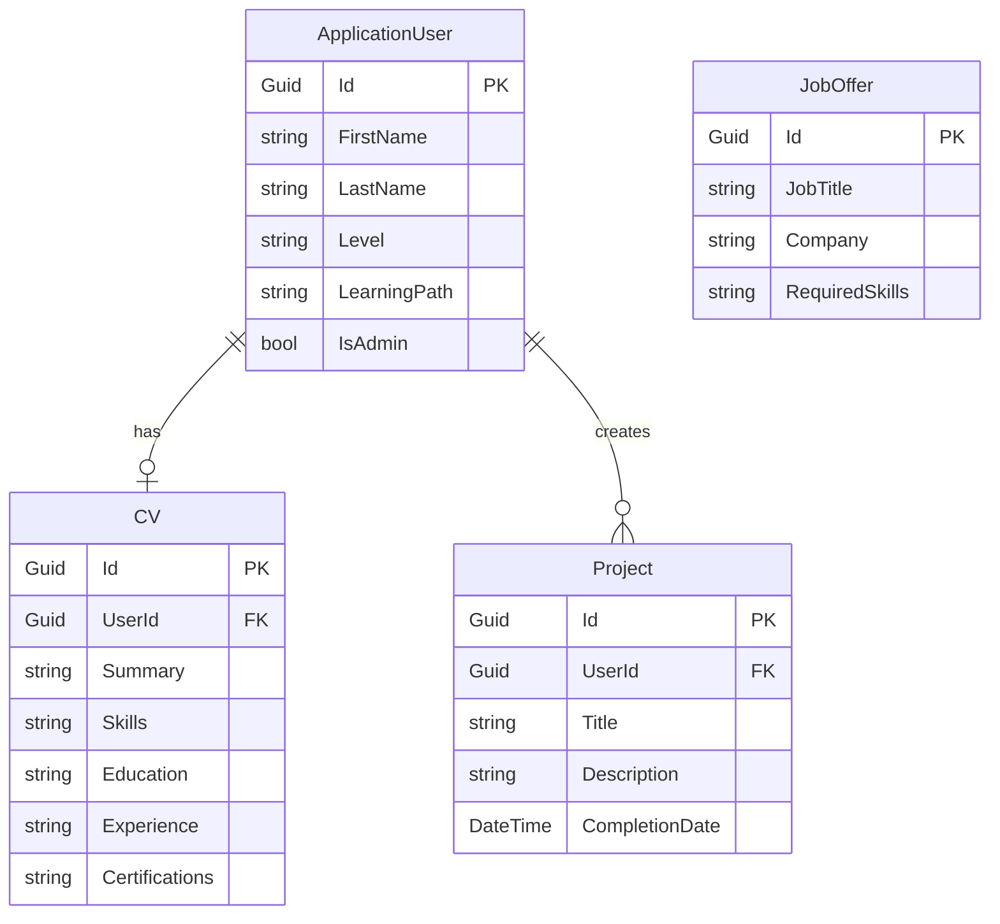

# Entity Relationship Diagrams (ERD)
## CodeWave Learning Platform

**Version:** 1.0  
**Date:** December 2024

---

## Table of Contents

1. [Overview](#overview)
2. [Complete ER Diagram](#complete-er-diagram)
3. [Module-Specific Diagrams](#module-specific-diagrams)
4. [Entity Details](#entity-details)
5. [Relationship Details](#relationship-details)

---

## Overview

This document contains Entity Relationship Diagrams (ERD) for the CodeWave Learning Platform database schema. The database uses MySQL 8.0 and follows a clean architecture pattern with Entity Framework Core.

### Key Design Principles

- **Soft Deletes**: Most entities use `IsDeleted` flag instead of hard deletes
- **GUID Primary Keys**: All entities use `Guid` as primary key
- **Audit Fields**: `CreatedAt` timestamp on most entities
- **Cascade Deletes**: Used carefully to maintain referential integrity
- **Many-to-Many**: Resolved through junction tables (e.g., `UserCourse`)

---

## Complete ER Diagram

```mermaid
erDiagram
    ApplicationUser ||--o{ UserAssesment : "takes"
    ApplicationUser ||--o{ UserCourse : "enrolls"
    ApplicationUser ||--o{ LessonCompletion : "completes"
    ApplicationUser ||--o{ ExerciseSubmission : "submits"
    ApplicationUser ||--o{ UserQuizAttempt : "attempts"
    ApplicationUser ||--o{ Project : "creates"
    ApplicationUser ||--o| CV : "has"
    
    Assessment ||--o{ Question : "contains"
    Assessment ||--o{ UserAssesment : "has"
    
    Question ||--o{ AnswerOption : "has"
    Question ||--o{ UserAnswer : "answered_by"
    
    AnswerOption ||--o{ UserAnswer : "selected_in"
    
    UserAssesment ||--o{ UserAnswer : "contains"
    
    Course ||--o{ Lesson : "contains"
    Course ||--o{ UserCourse : "enrolled_by"
    Course ||--o{ Quiz : "has"
    
    Lesson ||--o{ CodingExercise : "has"
    Lesson ||--o{ LessonCompletion : "completed_by"
    
    CodingExercise ||--o{ ExerciseTestCase : "has"
    CodingExercise ||--o{ ExerciseSubmission : "submitted_for"
    
    Quiz ||--o{ QuizQuestion : "contains"
    Quiz ||--o{ UserQuizAttempt : "attempted_by"
    
    QuizQuestion ||--o{ QuizAnswerOption : "has"
    QuizQuestion ||--o{ UserQuizAnswer : "answered_in"
    
    QuizAnswerOption ||--o{ UserQuizAnswer : "selected_in"
    
    UserQuizAttempt ||--o{ UserQuizAnswer : "contains"
    
    ApplicationUser {
        Guid Id PK
        string UserName
        string Email
        string FirstName
        string LastName
        string Description
        string Level
        string LearningPath
        string Interests
        string Goal
        string SkillLevel
        string Motivation
        int WeeklyHours
        string PreferredLanguage
        string ProfilePictureUrl
        bool IsAdmin
    }
    
    Assessment {
        Guid Id PK
        string Title
        DateTime CreatedAt
        bool isDeleted
    }
    
    Question {
        Guid Id PK
        Guid AssessmentId FK
        string Text
        string Difficulty
        DateTime CreatedAt
        bool isDeleted
    }
    
    AnswerOption {
        Guid Id PK
        Guid QuestionId FK
        string Text
        bool IsCorrect
        DateTime CreatedAt
        bool isDeleted
    }
    
    UserAssesment {
        Guid Id PK
        Guid UserId FK
        Guid AssessmentId FK
        double Score
        string ResultLevel
        string AssignedLearningPath
        DateTime DateTaken
        DateTime CreatedAt
        bool isDeleted
    }
    
    UserAnswer {
        Guid Id PK
        Guid UserAssessmentId FK
        Guid QuestionId FK
        Guid AnswerOptionId FK
        bool IsCorrect
    }
    
    Course {
        Guid Id PK
        string Title
        string Description
        string DifficultyLevel
        string LearningPath
        Language ProgrammingLanguage
        DateTime CreatedAt
        bool IsDeleted
    }
    
    Lesson {
        Guid Id PK
        Guid CourseId FK
        string Title
        string Content
        string VideoUrl
        string ImageUrl
        int OrderNumber
        DateTime CreatedAt
        bool isDeleted
    }
    
    CodingExercise {
        Guid Id PK
        Guid LessonId FK
        string Title
        string Description
        string StarterCode
        string ExpectedOutput
        DateTime CreatedAt
        bool isDeleted
    }
    
    ExerciseTestCase {
        Guid Id PK
        Guid ExerciseId FK
        string Input
        string ExpectedOutput
        string Description
        int OrderNumber
        DateTime CreatedAt
        bool IsDeleted
    }
    
    ExerciseSubmission {
        Guid Id PK
        Guid UserId FK
        Guid ExerciseId FK
        string SubmittedCode
        string Output
        bool IsCorrect
        DateTime SubmissionDate
        DateTime CreatedAt
        bool isDeleted
    }
    
    LessonCompletion {
        Guid Id PK
        Guid UserId FK
        Guid LessonId FK
        bool IsCompleted
        DateTime CompletionDate
        int TimeSpentMinutes
        DateTime CreatedAt
        bool isDeleted
    }
    
    UserCourse {
        Guid Id PK
        Guid UserId FK
        Guid CourseId FK
        int ProgressPercent
        DateTime CompletionDate
        DateTime CreatedAt
        bool isDeleted
    }
    
    Quiz {
        Guid Id PK
        Guid CourseId FK
        string Title
        string Description
        int TimeLimitMinutes
        int PassingScore
        DateTime CreatedAt
        bool IsDeleted
    }
    
    QuizQuestion {
        Guid Id PK
        Guid QuizId FK
        string Text
        string Difficulty
        int OrderNumber
        DateTime CreatedAt
        bool IsDeleted
    }
    
    QuizAnswerOption {
        Guid Id PK
        Guid QuizQuestionId FK
        string Text
        bool IsCorrect
        DateTime CreatedAt
        bool IsDeleted
    }
    
    UserQuizAttempt {
        Guid Id PK
        Guid UserId FK
        Guid QuizId FK
        double Score
        bool IsPassed
        DateTime StartedAt
        DateTime CompletedAt
        int TimeSpentMinutes
        DateTime CreatedAt
        bool IsDeleted
    }
    
    UserQuizAnswer {
        Guid Id PK
        Guid UserQuizAttemptId FK
        Guid QuizQuestionId FK
        Guid SelectedAnswerOptionId FK
        bool IsCorrect
        DateTime CreatedAt
        bool IsDeleted
    }
    
    JobOffer {
        Guid Id PK
        string JobTitle
        string Company
        string Description
        string RequiredSkills
        DateTime PostedDate
        DateTime Deadline
        DateTime CreatedAt
        bool isDeleted
    }
    
    Project {
        Guid Id PK
        Guid UserId FK
        string Title
        string Description
        DateTime CompletionDate
        string Result
        DateTime CreatedAt
        bool isDeleted
    }
    
    CV {
        Guid Id PK
        Guid UserId FK
        string Summary
        string Skills
        string Education
        string Experience
        string Certifications
        DateTime LastUpdated
    }
```

---

## Module-Specific Diagrams

### 1. Assessment Module

**Relationships:**
- Assessment → Question: One-to-Many (Cascade Delete)
- Question → AnswerOption: One-to-Many (Cascade Delete)
- Assessment → UserAssesment: One-to-Many
- UserAssesment → UserAnswer: One-to-Many
- UserAnswer → Question: Many-to-One (Restrict Delete)
- UserAnswer → AnswerOption: Many-to-One (Restrict Delete)

---

### 2. Learning Content Module

**Relationships:**
- Course → Lesson: One-to-Many (Cascade Delete)
- Course → UserCourse: One-to-Many
- Course → Quiz: One-to-Many (Cascade Delete)
- Lesson → CodingExercise: One-to-Many
- Lesson → LessonCompletion: One-to-Many
- CodingExercise → ExerciseTestCase: One-to-Many (Cascade Delete)
- CodingExercise → ExerciseSubmission: One-to-Many
- ApplicationUser → UserCourse: One-to-Many
- ApplicationUser → LessonCompletion: One-to-Many
- ApplicationUser → ExerciseSubmission: One-to-Many

---

### 3. Quiz System Module

**Relationships:**
- Course → Quiz: One-to-Many (Cascade Delete)
- Quiz → QuizQuestion: One-to-Many (Cascade Delete)
- Quiz → UserQuizAttempt: One-to-Many (Restrict Delete)
- QuizQuestion → QuizAnswerOption: One-to-Many (Cascade Delete)
- QuizQuestion → UserQuizAnswer: One-to-Many (Restrict Delete)
- QuizAnswerOption → UserQuizAnswer: One-to-Many (Restrict Delete)
- UserQuizAttempt → UserQuizAnswer: One-to-Many (Cascade Delete)
- ApplicationUser → UserQuizAttempt: One-to-Many (Cascade Delete)

---

### 4. User Profile Module

**Relationships:**
- ApplicationUser → CV: One-to-One
- ApplicationUser → Project: One-to-Many
- JobOffer: Standalone entity (no direct user relationship)

---

## Entity Details

### Core Entities

#### ApplicationUser
- **Primary Key**: `Id` (Guid)
- **Inherits**: `IdentityUser<Guid>` (ASP.NET Core Identity)
- **Key Relationships**:
  - One-to-Many with `UserAssesment`
  - One-to-Many with `UserCourse`
  - One-to-Many with `LessonCompletion`
  - One-to-Many with `ExerciseSubmission`
  - One-to-Many with `UserQuizAttempt`
  - One-to-Many with `Project`
  - One-to-One with `CV`
- **Special Fields**:
  - `IsAdmin`: Boolean flag for admin role
  - `LearningPath`: Assigned learning path (Python/Java)
  - `Level`: User skill level (Beginner/Intermediate/Advanced)

#### Course
- **Primary Key**: `Id` (Guid)
- **Key Relationships**:
  - One-to-Many with `Lesson`
  - One-to-Many with `UserCourse`
  - One-to-Many with `Quiz`
- **Special Fields**:
  - `ProgrammingLanguage`: Enum (Python/Java)
  - `LearningPath`: String identifier
  - `IsDeleted`: Soft delete flag

#### Lesson
- **Primary Key**: `Id` (Guid)
- **Foreign Key**: `CourseId` → Course
- **Key Relationships**:
  - Many-to-One with `Course`
  - One-to-Many with `CodingExercise`
  - One-to-Many with `LessonCompletion`
- **Special Fields**:
  - `OrderNumber`: Sequence within course
  - `Content`: Full lesson content (text)
  - `VideoUrl`, `ImageUrl`: Optional media

#### CodingExercise
- **Primary Key**: `Id` (Guid)
- **Foreign Key**: `LessonId` → Lesson
- **Key Relationships**:
  - Many-to-One with `Lesson`
  - One-to-Many with `ExerciseTestCase`
  - One-to-Many with `ExerciseSubmission`
- **Special Fields**:
  - `StarterCode`: Initial code template
  - `ExpectedOutput`: Expected result

#### ExerciseTestCase
- **Primary Key**: `Id` (Guid)
- **Foreign Key**: `ExerciseId` → CodingExercise
- **Key Relationships**:
  - Many-to-One with `CodingExercise`
- **Special Fields**:
  - `Input`: Test input data
  - `ExpectedOutput`: Expected output for this test
  - `OrderNumber`: Test case sequence

#### Quiz
- **Primary Key**: `Id` (Guid)
- **Foreign Key**: `CourseId` → Course
- **Key Relationships**:
  - Many-to-One with `Course`
  - One-to-Many with `QuizQuestion`
  - One-to-Many with `UserQuizAttempt`
- **Special Fields**:
  - `TimeLimitMinutes`: Optional time limit
  - `PassingScore`: Percentage required to pass (default 70)
  - **Validation**: Must have at least one question

#### QuizQuestion
- **Primary Key**: `Id` (Guid)
- **Foreign Key**: `QuizId` → Quiz
- **Key Relationships**:
  - Many-to-One with `Quiz`
  - One-to-Many with `QuizAnswerOption`
  - One-to-Many with `UserQuizAnswer`
- **Special Fields**:
  - `OrderNumber`: Question sequence
  - `Difficulty`: Easy/Medium/Hard

#### UserQuizAttempt
- **Primary Key**: `Id` (Guid)
- **Foreign Keys**: `UserId` → ApplicationUser, `QuizId` → Quiz
- **Key Relationships**:
  - Many-to-One with `ApplicationUser`
  - Many-to-One with `Quiz`
  - One-to-Many with `UserQuizAnswer`
- **Special Fields**:
  - `Score`: Percentage score (double)
  - `IsPassed`: Boolean pass/fail
  - `TimeSpentMinutes`: Duration tracking

---

## Relationship Details

### Delete Behaviors

#### Cascade Delete
- Assessment → Question
- Question → AnswerOption
- Course → Lesson
- Course → Quiz
- Quiz → QuizQuestion
- QuizQuestion → QuizAnswerOption
- CodingExercise → ExerciseTestCase
- UserQuizAttempt → UserQuizAnswer
- ApplicationUser → UserQuizAttempt

#### Restrict Delete
- Quiz → UserQuizAttempt (prevents deletion if attempts exist)
- QuizQuestion → UserQuizAnswer
- QuizAnswerOption → UserQuizAnswer
- Question → UserAnswer
- AnswerOption → UserAnswer

### Cardinality Summary

| Relationship | Type | Cardinality |
|-------------|------|-------------|
| User → Assessment | Takes | 1:N |
| Assessment → Question | Contains | 1:N |
| Question → AnswerOption | Has | 1:N |
| Course → Lesson | Contains | 1:N |
| Lesson → Exercise | Has | 1:N |
| Exercise → TestCase | Has | 1:N |
| Course → Quiz | Has | 1:N |
| Quiz → Question | Contains | 1:N |
| Question → AnswerOption | Has | 1:N |
| User → Course | Enrolls | M:N (via UserCourse) |
| User → Lesson | Completes | M:N (via LessonCompletion) |
| User → Exercise | Submits | M:N (via ExerciseSubmission) |
| User → Quiz | Attempts | M:N (via UserQuizAttempt) |
| User → CV | Has | 1:1 |

### Indexes (Recommended)

- `ApplicationUser.Email` (unique, from Identity)
- `ApplicationUser.UserName` (unique, from Identity)
- `Course.LearningPath`
- `Lesson.CourseId`
- `Lesson.OrderNumber`
- `CodingExercise.LessonId`
- `ExerciseSubmission.UserId`
- `ExerciseSubmission.ExerciseId`
- `LessonCompletion.UserId`
- `LessonCompletion.LessonId`
- `Quiz.CourseId`
- `UserQuizAttempt.UserId`
- `UserQuizAttempt.QuizId`

---

## Database Constraints

### Foreign Key Constraints

All foreign key relationships are enforced at the database level through Entity Framework Core migrations.

### Check Constraints (Recommended)

- `Quiz.PassingScore`: Should be between 0 and 100
- `UserCourse.ProgressPercent`: Should be between 0 and 100
- `UserQuizAttempt.Score`: Should be between 0 and 100
- `ExerciseSubmission.IsCorrect`: Boolean constraint
- `AnswerOption.IsCorrect`: Boolean constraint
- `QuizAnswerOption.IsCorrect`: Boolean constraint

### Unique Constraints

- `ApplicationUser.Email` (from Identity)
- `ApplicationUser.UserName` (from Identity)
- `ApplicationUser.Id` (from Identity)
- `CV.UserId` (one CV per user)

### Not Null Constraints

- All primary keys (Id)
- All foreign keys
- `Course.Title`
- `Lesson.Title`, `Lesson.Content`
- `CodingExercise.Title`, `CodingExercise.Description`
- `Quiz.Title`
- `QuizQuestion.Text`
- `ApplicationUser.Email`, `ApplicationUser.UserName`

---

## Notes

1. **Soft Deletes**: Most entities use `IsDeleted` flag instead of physical deletion to maintain data integrity and audit trails.

2. **GUID Primary Keys**: All entities use `Guid` as primary key for better distributed system support and security.

3. **Audit Fields**: Most entities include `CreatedAt` timestamp for tracking creation time.

4. **Time Tracking**: `LessonCompletion` and `UserQuizAttempt` include time tracking fields (`TimeSpentMinutes`).

5. **Validation**: The `Quiz` entity has application-level validation requiring at least one question before saving.

6. **Enum Storage**: The `Course.ProgrammingLanguage` enum is stored as integer in the database.

7. **Identity Integration**: `ApplicationUser` extends ASP.NET Core Identity's `IdentityUser<Guid>`, inheriting authentication-related fields and tables.

---

**End of Document**

