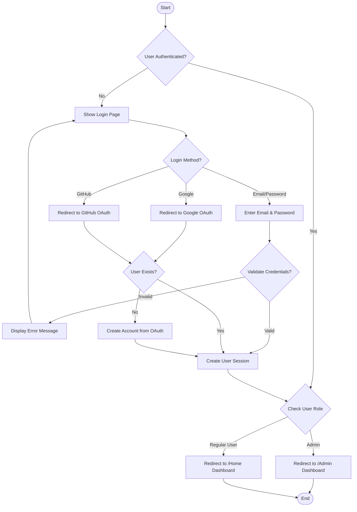
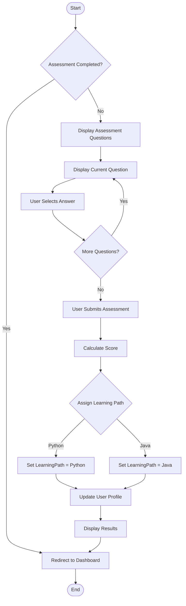
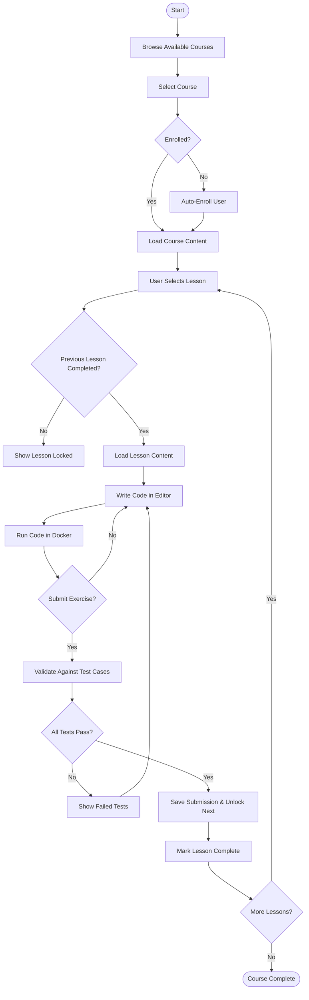
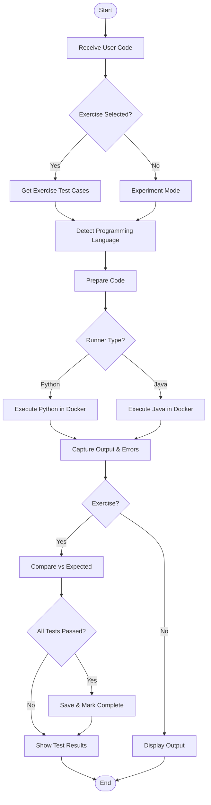
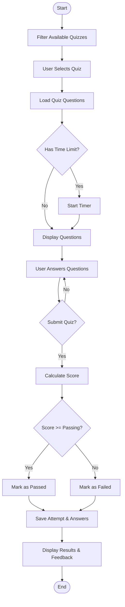
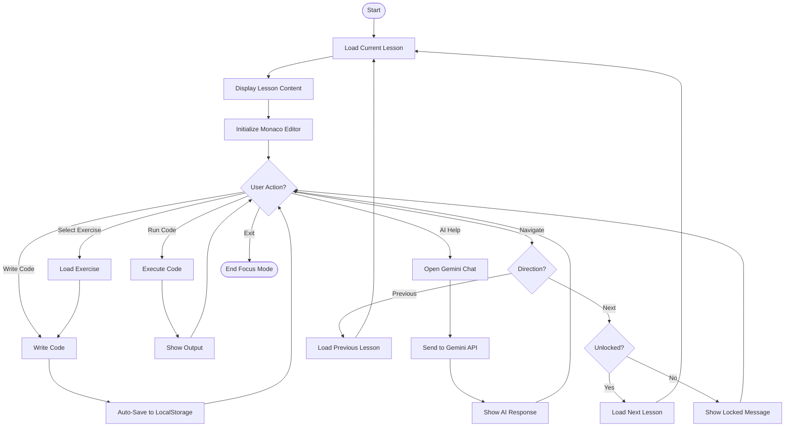
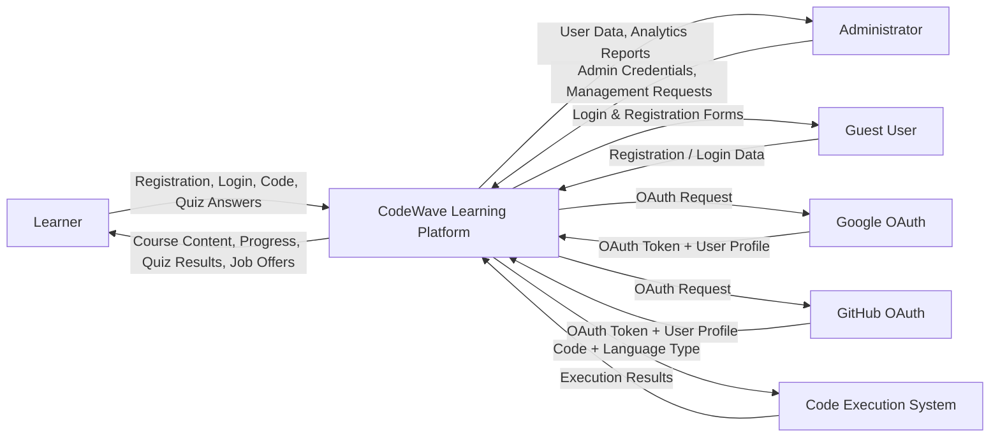

# CodeWave – Complete FYP Document
## CSCI420 – Final Year Project

---

**Project Title:** CodeWave – Interactive Programming Learning Platform

**Group Members:**
- [Student Name 1]
- [Student Name 2]
- [Student Name 3]

**Submission Date:** April 20, 2026

**Supervisor:** CSCI420 Course Supervisor

**Document Version:** 1.0

---

## Table of Contents

### Part 1 – Project Proposal (Vision Document)
1. [Project Idea](#1-project-idea)
2. [Problem Statement](#2-problem-statement)
3. [Need and Significance](#3-need-and-significance)
4. [Novelty and Innovation](#4-novelty-and-innovation)
5. [Key Features](#5-key-features)

### Part 2 – Engineering (SE Document)
6. [Functional Requirements](#6-functional-requirements)
7. [Use Cases](#7-use-cases)
8. [Edge Cases](#8-edge-cases)
9. [ER Diagram](#9-er-diagram)
10. [UI Interfaces](#10-ui-interfaces)
11. [APIs and Services](#11-apis-and-services)

### Appendices
12. [Activity Diagrams](#12-activity-diagrams)
13. [Data Flow Diagrams (DFD)](#13-data-flow-diagrams-dfd)
14. [System Architecture](#14-system-architecture)
15. [Non-Functional Requirements](#15-non-functional-requirements)
16. [PlantUML Source Code](#16-plantuml-source-code)

---

# PART 1 – PROJECT PROPOSAL (VISION DOCUMENT)

---

## 1. Project Idea

CodeWave is a web-based Learning Management System (LMS) purpose-built for programming education. The platform allows learners to enroll in structured Python and Java courses, write and execute code directly in the browser, take auto-graded quizzes, and track their learning progress — all in one place.

Beyond learning, CodeWave integrates career-readiness tools: learners can automatically generate a professional PDF CV populated from their completed courses and achievements, and browse a curated job offers board. An AI-powered Focus Mode embeds a Google Gemini chatbot directly into the coding environment, providing contextual assistance without leaving the platform.

The system supports two roles — Learner and Administrator — and is built on a clean four-layer architecture (Domain, Application, Infrastructure, Web) using ASP.NET Core 9.0, MySQL, Entity Framework Core, Docker, and SignalR.

---

## 2. Problem Statement

Learning to program today requires juggling a fragmented set of tools: video tutorials on one platform, a separate code editor, quizzes somewhere else, and no clear connection between effort and career opportunities. This fragmentation creates friction that discourages beginners and reduces learning effectiveness.

Specifically, the problems CodeWave addresses are:

- **No integrated practice environment:** Mainstream platforms (Udemy, Coursera, YouTube) provide content but no hands-on code execution linked to lessons.
- **Lack of personalization:** Learners with different skill levels are given the same content, with no adaptive routing based on existing knowledge.
- **No career bridge:** There is no direct link between what a learner has mastered and how that translates into employability or a professional profile.
- **Passive learning:** Most platforms deliver content passively (watch → read) rather than actively (code → test → feedback).
- **No real-time feedback during practice:** Learners working on coding exercises have no in-context assistance when stuck.

---

## 3. Need and Significance

**Why this matters now:**

- Demand for software developers continues to grow globally, yet entry barriers remain high due to poor learning tooling.
- Self-paced learners drop out at high rates on existing platforms primarily because they lack immediate, interactive feedback loops.
- Educators and bootcamps need affordable, configurable LMS solutions that go beyond slide decks and PDFs.

**Significance of CodeWave:**

- Provides a **single, unified platform** covering content delivery, interactive practice, assessment, and career preparation.
- **Reduces the cost of entry** to quality programming education by eliminating the need to subscribe to multiple services.
- Enables **data-driven learning** through progress dashboards and analytics that identify strengths and weaknesses.
- The **CV auto-generation** feature directly maps learning achievements to professional outcomes, creating a tangible return on investment for learners.
- The Docker-based execution sandbox makes the platform safe and scalable — each code run is isolated, protecting both the learner's work and the server.

---

## 4. Novelty and Innovation

CodeWave differentiates itself from existing platforms through five key innovations:

| # | Innovation | Description |
|---|------------|-------------|
| 1 | **Docker-based secure code sandbox** | Each code submission runs in an isolated Docker container, enabling safe execution of arbitrary Python and Java code without risk to the host system. This is the same approach used by production-grade platforms (e.g., LeetCode, HackerRank). |
| 2 | **AI-powered Focus Mode** | A distraction-free coding environment with a Google Gemini chatbot embedded directly in the editor panel. Learners can ask questions and get contextual hints without switching tabs or leaving their flow state. |
| 3 | **Achievement-driven CV generation** | The platform automatically constructs a professional PDF CV for each learner based on courses completed, skills acquired, and exercises passed — making the learning record immediately portable and shareable with employers. |
| 4 | **Assessment-gated adaptive enrollment** | New users take a skill assessment quiz before being assigned to a learning path. The system routes them to the appropriate starting point (Python beginner, Java intermediate, etc.) rather than forcing all users through the same linear content. |
| 5 | **Real-time progress notifications via SignalR** | Lesson completions, quiz results, and achievement unlocks are pushed to the client in real time, creating an engaging, responsive experience comparable to native mobile applications. |

---

## 5. Key Features

### Learner-Facing Features

- **User registration and authentication** — standard email/password and OAuth login via Google and GitHub
- **Skill assessment quiz** — determines the learner's entry point on enrollment
- **Structured courses and lessons** — organized content modules for Python and Java
- **Monaco-based code editor** — the same editor powering VS Code, embedded in the browser
- **Real-time code execution** — submit Python or Java code and see output instantly, powered by Docker runners
- **Quiz system** — lesson-linked quizzes with automated grading and instant feedback
- **Progress dashboard** — visual tracking of completed lessons, quiz scores, and overall course progress
- **AI Focus Mode** — distraction-free coding environment with integrated Google Gemini chatbot
- **CV generator** — auto-populated PDF CV based on course completions and earned achievements
- **Job offers board** — curated listings that learners can apply to directly from the platform

### Administrator Features

- **Admin dashboard** — overview of platform activity with Chart.js analytics for user engagement and skill distribution
- **Content management** — create, edit, and publish courses, lessons, exercises, and quizzes
- **User management** — view, edit, manage, and toggle admin status for learner accounts
- **Job offer management** — create and manage job listings with deadlines

### Platform Features

- **Role-based access control** — enforced separation between Learner and Admin capabilities
- **Real-time notifications** — SignalR-powered push events for achievements and progress milestones
- **Responsive UI** — Tailwind CSS-based design that works across desktop and mobile browsers
- **Secure architecture** — four-layer clean architecture with repository pattern and unit of work

---

# PART 2 – ENGINEERING (SE DOCUMENT)

---

## 6. Functional Requirements

### 6.1 User Authentication and Authorization

#### 6.1.1 User Registration
**Priority:** High

| ID | Requirement |
|----|-------------|
| FR-1.1 | System shall allow users to register with email and password |
| FR-1.2 | System shall support OAuth registration via Google |
| FR-1.3 | System shall support OAuth registration via GitHub |
| FR-1.4 | System shall validate email format and password strength |
| FR-1.5 | System shall redirect new users to onboarding/assessment flow |
| FR-1.6 | System shall store user profile information (FirstName, LastName, Email) |

#### 6.1.2 User Login
**Priority:** High

| ID | Requirement |
|----|-------------|
| FR-2.1 | System shall allow email/password login |
| FR-2.2 | System shall support Google OAuth login |
| FR-2.3 | System shall support GitHub OAuth login |
| FR-2.4 | System shall redirect admins to `/Admin` dashboard after login |
| FR-2.5 | System shall redirect regular users to `/Home` dashboard after login |
| FR-2.6 | System shall maintain session state after login |
| FR-2.7 | System shall handle invalid credentials with error messages |

#### 6.1.3 Role-Based Access Control
**Priority:** High

| ID | Requirement |
|----|-------------|
| FR-3.1 | System shall support two user roles: Admin and Regular User |
| FR-3.2 | System shall restrict admin pages to users with `IsAdmin = true` |
| FR-3.3 | System shall use policy-based authorization (`AdminOnly` policy) |
| FR-3.4 | System shall add `IsAdmin` claim to user principal for admins |

---

### 6.2 Learning Path Assessment

#### 6.2.1 Initial Assessment
**Priority:** High

| ID | Requirement |
|----|-------------|
| FR-4.1 | System shall present assessment questions to new users |
| FR-4.2 | System shall collect user answers to assessment questions |
| FR-4.3 | System shall evaluate answers to determine skill level |
| FR-4.4 | System shall assign learning path (Python or Java) based on assessment |
| FR-4.5 | System shall set user's `Level` and `LearningPath` properties |
| FR-4.6 | System shall redirect users to their assigned learning path dashboard |

---

### 6.3 Course Management

#### 6.3.1 Course Browsing
**Priority:** High

| ID | Requirement |
|----|-------------|
| FR-5.1 | System shall display courses filtered by user's learning path |
| FR-5.2 | System shall show course title, description, difficulty level |
| FR-5.3 | System shall display course progress for enrolled users |
| FR-5.4 | System shall allow users to navigate to course details |

#### 6.3.2 Course Enrollment
**Priority:** High

| ID | Requirement |
|----|-------------|
| FR-6.1 | System shall automatically enroll users in courses matching their learning path |
| FR-6.2 | System shall create `UserCourse` entry upon enrollment |
| FR-6.3 | System shall track enrollment date |

#### 6.3.3 Course Content
**Priority:** High

| ID | Requirement |
|----|-------------|
| FR-7.1 | System shall display course lessons in order |
| FR-7.2 | System shall show lesson content with code examples |
| FR-7.3 | System shall provide coding exercises for each lesson |
| FR-7.4 | System shall track lesson completion |
| FR-7.5 | System shall unlock next lesson upon completion |

---

### 6.4 Interactive Code Editor

#### 6.4.1 Code Editor Interface
**Priority:** High

| ID | Requirement |
|----|-------------|
| FR-8.1 | System shall provide Monaco Editor for code editing |
| FR-8.2 | System shall support syntax highlighting for Python and Java |
| FR-8.3 | System shall provide code snippets/suggestions |
| FR-8.4 | System shall auto-save user code to local storage |
| FR-8.5 | System shall allow code execution without exercise selection (experiment mode) |
| FR-8.6 | System shall display code editor in Focus Mode lesson view |

#### 6.4.2 Code Execution
**Priority:** High

| ID | Requirement |
|----|-------------|
| FR-9.1 | System shall execute Python code using Python 3 interpreter |
| FR-9.2 | System shall execute Java code using Java compiler and runtime |
| FR-9.3 | System shall detect programming language from course context |
| FR-9.4 | System shall run code in isolated Docker containers |
| FR-9.5 | System shall display execution output in console |
| FR-9.6 | System shall handle compilation and runtime errors |
| FR-9.7 | System shall support code execution with or without exercise context |

#### 6.4.3 Exercise Submission
**Priority:** High

| ID | Requirement |
|----|-------------|
| FR-10.1 | System shall validate code against multiple test cases |
| FR-10.2 | System shall compare output with expected results |
| FR-10.3 | System shall provide detailed test case results |
| FR-10.4 | System shall mark exercise as completed when all tests pass |
| FR-10.5 | System shall save exercise submission with timestamp |
| FR-10.6 | System shall unlock next lesson upon exercise completion |

---

### 6.5 Progress Tracking

#### 6.5.1 User Dashboard
**Priority:** High

| ID | Requirement |
|----|-------------|
| FR-11.1 | System shall display completed lessons count |
| FR-11.2 | System shall display completed exercises count |
| FR-11.3 | System shall display quiz attempts and scores |
| FR-11.4 | System shall calculate and display total study time |
| FR-11.5 | System shall show dynamically acquired skills |
| FR-11.6 | System shall identify user weaknesses |
| FR-11.7 | System shall display learning path progress percentage |

#### 6.5.2 Lesson Completion Tracking
**Priority:** High

| ID | Requirement |
|----|-------------|
| FR-12.1 | System shall record lesson completion with timestamp |
| FR-12.2 | System shall prevent duplicate completion entries |
| FR-12.3 | System shall calculate course progress based on completions |

---

### 6.6 Quiz System

#### 6.6.1 Quiz Display
**Priority:** Medium

| ID | Requirement |
|----|-------------|
| FR-13.1 | System shall display quizzes based on user's completed lessons |
| FR-13.2 | System shall filter quizzes by learning path |
| FR-13.3 | System shall show quiz title, description, question count |
| FR-13.4 | System shall display quiz icon on home page |

#### 6.6.2 Quiz Taking
**Priority:** Medium

| ID | Requirement |
|----|-------------|
| FR-14.1 | System shall present quiz questions one at a time or all at once |
| FR-14.2 | System shall provide multiple choice answer options |
| FR-14.3 | System shall allow users to select answers |
| FR-14.4 | System shall track time spent on quiz |
| FR-14.5 | System shall validate that quiz has at least one question |

#### 6.6.3 Quiz Results
**Priority:** Medium

| ID | Requirement |
|----|-------------|
| FR-15.1 | System shall calculate quiz score (percentage) |
| FR-15.2 | System shall determine pass/fail status (threshold: 70%) |
| FR-15.3 | System shall save quiz attempt with score and timestamp |
| FR-15.4 | System shall display correct/incorrect answers |
| FR-15.5 | System shall track user performance over time |

---

### 6.7 Focus Mode

| ID | Requirement |
|----|-------------|
| FR-16.1 | System shall display lesson content in full-screen focus mode |
| FR-16.2 | System shall provide code editor in focus mode |
| FR-16.3 | System shall allow exercise selection within lesson |
| FR-16.4 | System shall provide navigation to previous/next lesson |
| FR-16.5 | System shall make page scrollable for long content |
| FR-16.6 | System shall integrate AI Helper chat (Google Gemini) |
| FR-17.1 | System shall provide chat interface in focus mode |
| FR-17.2 | System shall send user messages to Google Gemini API |
| FR-17.3 | System shall render AI responses in markdown format |
| FR-17.4 | System shall maintain chat history during session |

---

### 6.8 Admin Dashboard

| ID | Requirement |
|----|-------------|
| FR-18.1 | System shall display total users count |
| FR-18.2 | System shall display total courses count |
| FR-18.3 | System shall display total job offers count |
| FR-18.4 | System shall show user engagement chart (Chart.js) |
| FR-18.5 | System shall show skill distribution chart (Chart.js) |
| FR-19.1 | Admin shall list all users with pagination |
| FR-19.2 | Admin shall search users by email, name |
| FR-19.3 | Admin shall create, edit, delete users |
| FR-19.4 | Admin shall toggle user admin status |
| FR-19.5 | Admin shall view user details (progress, courses, quizzes) |
| FR-20.1 | Admin shall create, edit, delete courses (soft delete) |
| FR-20.2 | Admin shall filter courses by learning path |
| FR-21.1 | Admin shall create, edit, delete job offers |
| FR-21.2 | Admin shall set job offer deadline |
| FR-22.1 | System shall display user progress and enrollment analytics |

---

### 6.9 Career Tools

| ID | Requirement |
|----|-------------|
| FR-23.1 | System shall display active job offers with title, company, skills, deadline |
| FR-23.2 | System shall allow users to filter job offers |
| FR-24.1 | System shall collect user's completed courses and acquired skills |
| FR-24.2 | System shall include quiz scores and projects in CV |
| FR-24.3 | System shall generate downloadable PDF CV document |
| FR-24.4 | System shall format CV professionally using QuestPDF |

---

## 7. Use Cases

### Actors

| Actor | Type | Description |
|-------|------|-------------|
| Learner | Primary | Student/professional learning Python or Java |
| Administrator | Primary | Platform manager with full system access |
| Guest User | Primary | Unauthenticated visitor (registration/login only) |
| Google OAuth | Secondary | External authentication provider |
| GitHub OAuth | Secondary | External authentication provider |
| Code Execution System | Secondary | Docker-based code runner |

---

### Use Case Diagram

```mermaid
graph TB
    subgraph "Authentication & Registration"
        UC1[UC1: Register Account]
        UC2[UC2: Login]
        UC3[UC3: Login with Google]
        UC4[UC4: Login with GitHub]
        UC5[UC5: Logout]
    end
    
    subgraph "Onboarding"
        UC6[UC6: Complete Assessment]
        UC7[UC7: View Onboarding Results]
    end
    
    subgraph "Learning Management"
        UC8[UC8: Browse Courses]
        UC9[UC9: View Course Details]
        UC10[UC10: Access Lesson]
        UC11[UC11: View Lesson Content]
        UC12[UC12: Complete Lesson]
        UC13[UC13: Access Focus Mode]
    end
    
    subgraph "Code Execution"
        UC14[UC14: Write Code]
        UC15[UC15: Execute Code]
        UC16[UC16: Submit Exercise]
        UC17[UC17: View Test Results]
    end
    
    subgraph "Progress Tracking"
        UC18[UC18: View Dashboard]
        UC19[UC19: View Progress Statistics]
        UC20[UC20: View Acquired Skills]
        UC21[UC21: View Weaknesses]
    end
    
    subgraph "Quiz System"
        UC22[UC22: View Available Quizzes]
        UC23[UC23: Take Quiz]
        UC24[UC24: Submit Quiz Answers]
        UC25[UC25: View Quiz Results]
    end
    
    subgraph "Career Tools"
        UC26[UC26: View Job Offers]
        UC27[UC27: Generate CV]
        UC28[UC28: View Projects]
    end
    
    subgraph "Admin Functions"
        UC29[UC29: View Admin Dashboard]
        UC30[UC30: Manage Users]
        UC31[UC31: Manage Courses]
        UC32[UC32: Manage Job Offers]
        UC33[UC33: View Reports]
        UC34[UC34: Create Course]
        UC35[UC35: Edit Course]
        UC36[UC36: Delete Course]
        UC37[UC37: Create User]
        UC38[UC38: Edit User]
        UC39[UC39: Delete User]
        UC40[UC40: Toggle Admin Status]
    end

    Learner --> UC1
    Learner --> UC2
    Learner --> UC3
    Learner --> UC4
    Learner --> UC5
    Learner --> UC6
    Learner --> UC7
    Learner --> UC8
    Learner --> UC9
    Learner --> UC10
    Learner --> UC11
    Learner --> UC12
    Learner --> UC13
    Learner --> UC14
    Learner --> UC15
    Learner --> UC16
    Learner --> UC17
    Learner --> UC18
    Learner --> UC19
    Learner --> UC20
    Learner --> UC21
    Learner --> UC22
    Learner --> UC23
    Learner --> UC24
    Learner --> UC25
    Learner --> UC26
    Learner --> UC27
    Learner --> UC28
    
    Admin --> UC2
    Admin --> UC5
    Admin --> UC29
    Admin --> UC30
    Admin --> UC31
    Admin --> UC32
    Admin --> UC33
    Admin --> UC34
    Admin --> UC35
    Admin --> UC36
    Admin --> UC37
    Admin --> UC38
    Admin --> UC39
    Admin --> UC40
    
    Guest --> UC1
    Guest --> UC2
    Guest --> UC3
    Guest --> UC4
```



---

### Use Case Descriptions

#### UC1: Register Account
**Actor:** Guest User | **Priority:** High  
**Preconditions:** User is not logged in

**Main Flow:**
1. User navigates to registration page
2. User enters email, password, first name, last name
3. System validates input (email format, password strength)
4. System creates user account
5. System logs user in automatically
6. System redirects to onboarding/assessment flow

**Alternative Flows:**
- 3a. Invalid email format → System displays error, user corrects
- 3b. Weak password → System displays requirements, user updates
- 3c. Email already exists → System displays error, prompts login

**Postconditions:** User account created, user logged in, redirected to assessment

---

#### UC2: Login
**Actor:** Guest User, Learner, Administrator | **Priority:** High  
**Preconditions:** User has an account

**Main Flow:**
1. User navigates to login page
2. User enters email and password
3. System validates credentials
4. System creates session
5. Admin users → redirect to `/Admin`, regular users → redirect to `/Home`

**Alternative Flows:**
- 3a. Invalid credentials → System displays error, user retries
- 3b. Account locked → System displays lockout message

---

#### UC3: Login with Google
**Actor:** Guest User | **Priority:** Medium  
1. User clicks "Login with Google"
2. System redirects to Google OAuth
3. User authorizes application
4. Google returns authentication token
5. System checks if user exists — creates account if new
6. System redirects to appropriate dashboard

---

#### UC4: Login with GitHub
**Actor:** Guest User | **Priority:** Medium  
Same flow as UC3 but via GitHub OAuth provider.

---

#### UC5: Logout
**Actor:** Learner, Administrator | **Priority:** High  
1. User clicks logout
2. System invalidates session
3. System redirects to welcome page

---

#### UC6: Complete Assessment
**Actor:** Learner | **Priority:** High  
**Preconditions:** User is logged in, has not completed assessment

**Main Flow:**
1. System displays assessment questions
2. User answers each question and submits
3. System evaluates answers, calculates score, determines level
4. System assigns learning path (Python or Java)
5. System updates user profile and redirects to dashboard

---

#### UC8: Browse Courses
**Actor:** Learner | **Priority:** High  
1. User navigates to courses
2. System retrieves courses matching user's learning path
3. System displays course list with titles, descriptions, progress
4. User filters or searches courses

---

#### UC10: Access Lesson
**Actor:** Learner | **Priority:** High  
1. User clicks on a lesson from course page
2. System checks if previous lessons are completed
3. If not completed → System prevents access and shows message
4. If unlocked → System displays lesson content

---

#### UC15: Execute Code
**Actor:** Learner | **Priority:** High  
1. User clicks "Run Code"
2. System detects programming language from course context
3. System sends code to Docker-based code execution service
4. System captures stdout and stderr output
5. System displays results in console section

**Alternative Flows:**
- Compilation error → System displays error with line number
- Runtime error → System displays exception message
- Timeout (>5s) → System displays "Execution timed out"

---

#### UC16: Submit Exercise
**Actor:** Learner | **Priority:** High  
1. User selects an exercise and writes code solution
2. User clicks "Submit"
3. System executes code against all test cases
4. System compares actual output vs expected output per test case
5. All tests pass → exercise marked complete, next lesson unlocked
6. Tests fail → System displays which test cases failed

---

#### UC23: Take Quiz
**Actor:** Learner | **Priority:** Medium  
1. User selects a quiz and clicks "Take Quiz"
2. System starts timer if applicable
3. User answers all questions
4. User submits quiz
5. System calculates score, determines pass/fail, saves attempt

---

#### UC27: Generate CV
**Actor:** Learner | **Priority:** Low  
1. User navigates to CV section
2. System collects completed courses, acquired skills, quiz scores, projects
3. System generates and formats PDF CV using QuestPDF
4. User downloads CV

**Alternative Flow:**
- No completed courses → System prompts to complete courses first

---

#### UC29: View Admin Dashboard
**Actor:** Administrator | **Priority:** High  
1. Admin is auto-redirected to `/Admin` after login
2. System retrieves platform statistics
3. System displays KPI cards, user engagement chart, skill distribution chart
4. Admin navigates to management sections

---

#### UC30–UC33: Admin Management (Summary)

| UC | Action | Description |
|----|--------|-------------|
| UC30 | Manage Users | View, search, create, edit, delete, toggle admin status |
| UC31 | Manage Courses | View, create, edit, soft-delete courses |
| UC32 | Manage Job Offers | Create, edit, delete job offers |
| UC33 | View Reports | View analytics: user progress, enrollment, quiz performance |

---

### Use Case Relationships

| Relationship | Type |
|-------------|------|
| UC10 → UC11 | Include (access lesson includes viewing content) |
| UC16 → UC15 | Include (submit exercise includes executing code) |
| UC23 → UC24 | Include (taking quiz includes submitting answers) |
| UC15 extends UC14 | Extend (execute extends write when submitted) |
| UC17 extends UC16 | Extend (test results extend exercise submission) |
| UC25 extends UC24 | Extend (quiz results extend quiz submission) |
| UC3, UC4 generalize UC2 | Generalization (OAuth specializations of login) |

---

## 8. Edge Cases

Edge cases document unexpected or boundary inputs and behaviors that the system must handle gracefully.

---

### 8.1 Registration and Authentication

| # | Scenario | Expected Behavior |
|---|----------|-------------------|
| EC-1.1 | Register with an email that already exists | System returns error: "Email already in use." User is directed to login. |
| EC-1.2 | Register with invalid email format (e.g., `user@`, `user.com`) | System rejects with validation error: "Enter a valid email address." |
| EC-1.3 | Register with password shorter than 6 characters | System rejects with: "Password must be at least 6 characters." |
| EC-1.4 | Register with mismatched password and confirm-password fields | System rejects with: "Passwords do not match." |
| EC-1.5 | OAuth provider returns no email (GitHub with private email setting) | System prompts user to enter an email manually before proceeding. |
| EC-1.6 | OAuth account email matches an existing local account | System links the OAuth identity to the existing account and logs in. |
| EC-1.7 | Login with correct email but wrong password repeated 5+ times | Account lockout triggered; system displays lockout message with retry timer. |
| EC-1.8 | User tries to access authenticated page without being logged in | System redirects to login page with return URL preserved. |
| EC-1.9 | Admin tries to access learner-only page | System serves page normally (admins have all learner access). |
| EC-1.10 | Regular user tries to access `/Admin` | System returns 403 Forbidden via `AdminOnly` policy. |

---

### 8.2 Assessment

| # | Scenario | Expected Behavior |
|---|----------|-------------------|
| EC-2.1 | User submits assessment without answering all questions | System prompts to answer all questions before submitting. |
| EC-2.2 | User navigates to assessment page after already completing it | System redirects to their dashboard (assessment already done). |
| EC-2.3 | Assessment database has no questions loaded | System displays an error message; admin is notified to seed assessment data. |
| EC-2.4 | All answers are incorrect (score = 0%) | System assigns a default learning path (e.g., Python Beginner) and proceeds. |

---

### 8.3 Courses and Lessons

| # | Scenario | Expected Behavior |
|---|----------|-------------------|
| EC-3.1 | User tries to access a lesson URL directly without completing prerequisites | System checks completion status and returns "Lesson locked" message. |
| EC-3.2 | Course has zero lessons | System displays course page with "No lessons available yet" message. |
| EC-3.3 | User navigates to a non-existent course ID | System returns 404 Not Found page. |
| EC-3.4 | User tries to access a soft-deleted course | System returns 404 Not Found (soft-deleted records are excluded from queries). |
| EC-3.5 | User accesses a course from a different learning path than assigned | System allows access (path filter is a recommendation, not a restriction). |
| EC-3.6 | Lesson completion is recorded twice (double-click or rapid navigation) | System applies FR-12.2 — duplicate completion entries are prevented; only one record stored. |

---

### 8.4 Code Execution

| # | Scenario | Expected Behavior |
|---|----------|-------------------|
| EC-4.1 | User submits empty code | System returns error: "Code cannot be empty." No Docker container spawned. |
| EC-4.2 | Code causes an infinite loop | Docker container enforces timeout (~5 seconds); system returns "Execution timed out." |
| EC-4.3 | Code crashes with a runtime exception | System captures stderr and displays error message (e.g., `NullPointerException at line 3`). |
| EC-4.4 | Code causes a compilation error (Java) | System displays compiler error with line numbers before attempting to run. |
| EC-4.5 | User submits Python code when the exercise is Java | System detects language mismatch from course context; warns user or executes as Python experiment. |
| EC-4.6 | Code output has trailing newlines/whitespace vs expected clean string | System trims both actual and expected output before comparison to avoid false failures. |
| EC-4.7 | Test case expects empty output (`""`) but code outputs nothing | System treats empty stdout as matching an empty expected output — passes. |
| EC-4.8 | Multiple simultaneous submissions from the same user | Each submission gets its own Docker container instance; race conditions are isolated. |
| EC-4.9 | Code attempts to read from stdin when no input is provided | System injects empty string for stdin; code either uses default values or throws handled exception. |
| EC-4.10 | Code execution service (Docker) is unavailable | System returns graceful error: "Code execution is temporarily unavailable. Please try again." |
| EC-4.11 | Exercise has no test cases defined | System disables the "Submit" button and shows: "This exercise has no test cases configured." |

---

### 8.5 Quiz System

| # | Scenario | Expected Behavior |
|---|----------|-------------------|
| EC-5.1 | Admin created a quiz with zero questions | System validates at quiz creation; blocks saving an empty quiz (FR-14.5). |
| EC-5.2 | Quiz time limit expires before user submits | System auto-submits quiz with current answers and calculates score. |
| EC-5.3 | User navigates away from quiz mid-session | Quiz attempt remains "in progress"; on return, system shows incomplete attempt warning. |
| EC-5.4 | User submits quiz with no answers selected | System either blocks (if required) or scores as 0% and marks as failed. |
| EC-5.5 | Quiz has a question with no correct answer option | System logs the data integrity issue; all options marked incorrect yields 0 points for that question. |
| EC-5.6 | Passing score threshold is set to 0% | All submissions automatically pass; system proceeds normally. |

---

### 8.6 CV Generation

| # | Scenario | Expected Behavior |
|---|----------|-------------------|
| EC-6.1 | User tries to generate CV with no completed courses | System displays warning: "Complete at least one course to generate your CV." |
| EC-6.2 | CV is generated a second time | System overwrites the existing CV record (one CV per user — unique constraint on `CV.UserId`). |
| EC-6.3 | PDF generation library (QuestPDF) encounters a layout error | System logs the error and returns a friendly message: "CV generation failed. Please try again." |

---

### 8.7 Job Offers

| # | Scenario | Expected Behavior |
|---|----------|-------------------|
| EC-7.1 | User views or applies to a job offer past its deadline | System marks offer as expired and disables the apply button. |
| EC-7.2 | Job offer has no required skills listed | System displays the offer without a skills section (empty field renders blank gracefully). |

---

### 8.8 Admin Operations

| # | Scenario | Expected Behavior |
|---|----------|-------------------|
| EC-8.1 | Admin tries to delete their own account | System blocks self-deletion with error: "You cannot delete your own account." |
| EC-8.2 | Admin tries to revoke their own admin status | System warns: "Revoking your own admin access will log you out of admin functions." |
| EC-8.3 | Admin deletes a course that has active enrollments | System performs soft delete (IsDeleted = true); enrolled users retain their progress records. |
| EC-8.4 | Admin tries to delete a user who has exercise submissions | Soft delete sets `IsDeleted = true` on the user; submission records are preserved for data integrity. |
| EC-8.5 | Admin creates a course with a duplicate title | System either allows it (no unique constraint on title) or warns if uniqueness is enforced. |
| EC-8.6 | Admin tries to save a quiz course entity without selecting a course | System returns validation error: "Course is required." |

---

### 8.9 Background Service and System

| # | Scenario | Expected Behavior |
|---|----------|-------------------|
| EC-9.1 | Background cleanup service runs and finds no temp files | Service completes silently with a log entry: "No files to clean up." |
| EC-9.2 | Database connection is lost during a user session | System returns a 500 error page; no data corruption occurs due to EF Core transaction rollback. |
| EC-9.3 | SignalR connection drops mid-session | Client-side JavaScript handles reconnection automatically (reconnect logic in `signalr-client.js`). |
| EC-9.4 | User has cookies disabled | OAuth and session-based auth will fail; system displays a message to enable cookies. |

---

## 9. ER Diagram

The database schema follows a clean architecture pattern with GUID primary keys, soft-delete flags, and audit timestamps on all entities.

### Key Design Principles
- **Soft Deletes:** Most entities use `IsDeleted` flag instead of hard deletes
- **GUID Primary Keys:** All entities use `Guid` as primary key
- **Audit Fields:** `CreatedAt` timestamp on most entities
- **Many-to-Many:** Resolved through junction tables (e.g., `UserCourse`, `LessonCompletion`)

---

### Complete ER Diagram

```mermaid
erDiagram
    ApplicationUser ||--o{ UserAssesment : "takes"
    ApplicationUser ||--o{ UserCourse : "enrolls"
    ApplicationUser ||--o{ LessonCompletion : "completes"
    ApplicationUser ||--o{ ExerciseSubmission : "submits"
    ApplicationUser ||--o{ UserQuizAttempt : "attempts"
    ApplicationUser ||--o{ Project : "creates"
    ApplicationUser ||--o| CV : "has"
    
    Assessment ||--o{ Question : "contains"
    Assessment ||--o{ UserAssesment : "has"
    
    Question ||--o{ AnswerOption : "has"
    Question ||--o{ UserAnswer : "answered_by"
    
    AnswerOption ||--o{ UserAnswer : "selected_in"
    UserAssesment ||--o{ UserAnswer : "contains"
    
    Course ||--o{ Lesson : "contains"
    Course ||--o{ UserCourse : "enrolled_by"
    Course ||--o{ Quiz : "has"
    
    Lesson ||--o{ CodingExercise : "has"
    Lesson ||--o{ LessonCompletion : "completed_by"
    
    CodingExercise ||--o{ ExerciseTestCase : "has"
    CodingExercise ||--o{ ExerciseSubmission : "submitted_for"
    
    Quiz ||--o{ QuizQuestion : "contains"
    Quiz ||--o{ UserQuizAttempt : "attempted_by"
    
    QuizQuestion ||--o{ QuizAnswerOption : "has"
    QuizQuestion ||--o{ UserQuizAnswer : "answered_in"
    
    QuizAnswerOption ||--o{ UserQuizAnswer : "selected_in"
    UserQuizAttempt ||--o{ UserQuizAnswer : "contains"

    ApplicationUser {
        Guid Id PK
        string UserName
        string Email
        string FirstName
        string LastName
        string Level
        string LearningPath
        bool IsAdmin
    }
    
    Course {
        Guid Id PK
        string Title
        string Description
        string DifficultyLevel
        string LearningPath
        Language ProgrammingLanguage
        DateTime CreatedAt
        bool IsDeleted
    }
    
    Lesson {
        Guid Id PK
        Guid CourseId FK
        string Title
        string Content
        int OrderNumber
        DateTime CreatedAt
        bool isDeleted
    }
    
    CodingExercise {
        Guid Id PK
        Guid LessonId FK
        string Title
        string Description
        string StarterCode
        string ExpectedOutput
        bool isDeleted
    }
    
    ExerciseTestCase {
        Guid Id PK
        Guid ExerciseId FK
        string Input
        string ExpectedOutput
        int OrderNumber
        bool IsDeleted
    }
    
    ExerciseSubmission {
        Guid Id PK
        Guid UserId FK
        Guid ExerciseId FK
        string SubmittedCode
        string Output
        bool IsCorrect
        DateTime SubmissionDate
    }
    
    LessonCompletion {
        Guid Id PK
        Guid UserId FK
        Guid LessonId FK
        bool IsCompleted
        int TimeSpentMinutes
        DateTime CompletionDate
    }
    
    UserCourse {
        Guid Id PK
        Guid UserId FK
        Guid CourseId FK
        int ProgressPercent
        DateTime CompletionDate
    }
    
    Quiz {
        Guid Id PK
        Guid CourseId FK
        string Title
        int TimeLimitMinutes
        int PassingScore
        bool IsDeleted
    }
    
    QuizQuestion {
        Guid Id PK
        Guid QuizId FK
        string Text
        string Difficulty
        int OrderNumber
        bool IsDeleted
    }
    
    QuizAnswerOption {
        Guid Id PK
        Guid QuizQuestionId FK
        string Text
        bool IsCorrect
        bool IsDeleted
    }
    
    UserQuizAttempt {
        Guid Id PK
        Guid UserId FK
        Guid QuizId FK
        double Score
        bool IsPassed
        int TimeSpentMinutes
        DateTime StartedAt
    }
    
    UserQuizAnswer {
        Guid Id PK
        Guid UserQuizAttemptId FK
        Guid QuizQuestionId FK
        Guid SelectedAnswerOptionId FK
        bool IsCorrect
    }
    
    Assessment {
        Guid Id PK
        string Title
        bool isDeleted
    }
    
    Question {
        Guid Id PK
        Guid AssessmentId FK
        string Text
        string Difficulty
    }
    
    AnswerOption {
        Guid Id PK
        Guid QuestionId FK
        string Text
        bool IsCorrect
    }
    
    UserAssesment {
        Guid Id PK
        Guid UserId FK
        Guid AssessmentId FK
        double Score
        string ResultLevel
        string AssignedLearningPath
        DateTime DateTaken
    }
    
    UserAnswer {
        Guid Id PK
        Guid UserAssessmentId FK
        Guid QuestionId FK
        Guid AnswerOptionId FK
        bool IsCorrect
    }
    
    JobOffer {
        Guid Id PK
        string JobTitle
        string Company
        string Description
        string RequiredSkills
        DateTime PostedDate
        DateTime Deadline
        bool isDeleted
    }
    
    Project {
        Guid Id PK
        Guid UserId FK
        string Title
        string Description
        DateTime CompletionDate
        string Result
    }
    
    CV {
        Guid Id PK
        Guid UserId FK
        string Summary
        string Skills
        string Education
        string Experience
        string Certifications
        DateTime LastUpdated
    }
```



---

### Relationship Summary

| Relationship | Type | Cardinality |
|-------------|------|-------------|
| User → Assessment | Takes | 1:N |
| Assessment → Question | Contains | 1:N |
| Question → AnswerOption | Has | 1:N |
| Course → Lesson | Contains | 1:N |
| Lesson → CodingExercise | Has | 1:N |
| CodingExercise → ExerciseTestCase | Has | 1:N |
| Course → Quiz | Has | 1:N |
| Quiz → QuizQuestion | Contains | 1:N |
| QuizQuestion → QuizAnswerOption | Has | 1:N |
| User ↔ Course | Enrolls | M:N (via UserCourse) |
| User ↔ Lesson | Completes | M:N (via LessonCompletion) |
| User ↔ CodingExercise | Submits | M:N (via ExerciseSubmission) |
| User ↔ Quiz | Attempts | M:N (via UserQuizAttempt) |
| User → CV | Has | 1:1 |

---

### Delete Behaviors

| Relationship | Behavior |
|-------------|----------|
| Assessment → Question | Cascade Delete |
| Course → Lesson | Cascade Delete |
| Course → Quiz | Cascade Delete |
| Quiz → QuizQuestion | Cascade Delete |
| QuizQuestion → QuizAnswerOption | Cascade Delete |
| CodingExercise → ExerciseTestCase | Cascade Delete |
| Quiz → UserQuizAttempt | Restrict (data preserved) |
| Most entities | Soft Delete via IsDeleted flag |

---

## 10. UI Interfaces

The following describes the key screens of the CodeWave web application. All UI is built using Razor Views with Tailwind CSS, supporting both light and dark themes with responsive layouts.

---

### 10.1 Welcome / Landing Page
**Route:** `/`  
**Access:** Public (Guest)

**Components:**
- Platform name and tagline ("Learn to Code. Get Hired.")
- "Get Started" and "Login" call-to-action buttons
- Feature highlights (code execution, AI mode, career tools)
- Responsive hero section

---

### 10.2 Login Page
**Route:** `/User/Login`  
**Access:** Guest

**Components:**
- Email and password fields with client-side validation
- "Login with Google" OAuth button
- "Login with GitHub" OAuth button
- Link to registration page
- Password visibility toggle
- Error message display area

---

### 10.3 Registration Page
**Route:** `/User/SignUp`  
**Access:** Guest

**Components:**
- First name, last name, email, password, confirm-password fields
- Real-time password strength indicator (color-coded bar)
- Real-time password match validation
- OAuth registration options (Google, GitHub)
- Data annotations-backed server validation

---

### 10.4 Assessment / Onboarding Page
**Route:** `/Assessment`  
**Access:** Authenticated (new users)

**Components:**
- Multi-step question display (one question at a time)
- Multiple-choice answer selection
- Progress indicator (Question 3 of 10)
- Submit button enabled only when all questions answered
- Results page showing assigned learning path (Python / Java)

---

### 10.5 Home Dashboard
**Route:** `/Home`  
**Access:** Authenticated Learner

**Components:**
- Welcome message with user name and learning path
- Progress statistics cards: Lessons Completed, Exercises Done, Quiz Score, Study Time
- Enrolled courses list with progress bars
- Recent activity feed
- Acquired skills tags
- Weaknesses section
- Job offers preview strip
- Quiz availability notification

---

### 10.6 Course List Page
**Route:** `/LearningPath/Courses`  
**Access:** Authenticated Learner

**Components:**
- Course cards with: title, description, difficulty badge, language icon, progress bar
- Search/filter bar (by language, difficulty)
- Enrolled vs. available status indicator

---

### 10.7 Lesson View Page
**Route:** `/LearningPath/Lesson/{lessonId}`  
**Access:** Authenticated Learner

**Components:**
- Lesson title and breadcrumb navigation
- Rich text lesson content (markdown rendered with code highlighting)
- Coding exercise panel on the right
- Monaco code editor (VS Code editor embedded)
- "Run Code" and "Submit" buttons
- Console output panel showing stdout/stderr
- Test case results table (Input | Expected | Actual | Status)
- "Focus Mode" button
- Lesson completion button

---

### 10.8 Focus Mode Page
**Route:** `/LearningPath/FocusMode/{lessonId}`  
**Access:** Authenticated Learner

**Components:**
- Full-screen layout with no navigation distractions
- Left panel: Lesson content (scrollable)
- Center panel: Monaco code editor
- Right panel: Exercise selector dropdown + test results
- AI Helper chat popup (bottom-right) powered by Google Gemini
- Previous / Next lesson navigation arrows
- Exit Focus Mode button

---

### 10.9 Quiz Page
**Route:** `/Quiz/Take/{quizId}`  
**Access:** Authenticated Learner

**Components:**
- Quiz title and description
- Question display with multiple-choice options (radio buttons)
- Timer countdown (if time limit configured)
- Question progress indicator (2/10)
- "Submit Quiz" button
- Results page: score percentage, pass/fail badge, per-question breakdown

---

### 10.10 Progress / Dashboard Stats Page
**Route:** `/Progress`  
**Access:** Authenticated Learner

**Components:**
- Circular progress charts per course
- Skills list with category grouping
- Weaknesses list with suggested review links
- Study time breakdown by day/week
- Quiz history table

---

### 10.11 CV Builder Page
**Route:** `/CV`  
**Access:** Authenticated Learner

**Components:**
- Auto-populated fields from: completed courses, acquired skills, quiz scores, projects
- Editable summary/bio field
- Education and experience manual input fields
- Preview pane showing formatted CV layout
- "Download PDF" button (QuestPDF generation)

---

### 10.12 Job Offers Page
**Route:** `/JobOffers`  
**Access:** Authenticated Learner

**Components:**
- Job listing cards: title, company name, description, required skills tags, deadline
- Filter bar by skill or company
- "Apply" button (disabled if deadline passed)
- Expired jobs shown with greyed styling

---

### 10.13 Admin Dashboard
**Route:** `/Admin`  
**Access:** Administrator only

**Components:**
- KPI cards: Total Users, Total Courses, Total Job Offers
- User Engagement Chart (Chart.js line chart — daily active users)
- Skill Distribution Chart (Chart.js bar chart — Beginner/Intermediate/Advanced)
- Navigation to: User Management, Course Management, Job Management, Reports
- Recent activity feed

---

### 10.14 Admin User Management
**Route:** `/Admin/Users`  
**Access:** Administrator only

**Components:**
- Paginated user table: Name, Email, Role, Learning Path, Status
- Search bar (by email or name)
- Action buttons per row: View Details, Edit, Delete, Toggle Admin
- Create User form modal/page
- User details panel: progress statistics, course list, quiz history

---

## 11. APIs and Services

### 11.1 REST API Endpoints

#### Courses API
**Base Route:** `/api/v1/CoursesApi`

| Method | Endpoint | Auth | Description |
|--------|----------|------|-------------|
| GET | `/api/v1/CoursesApi` | None | Get all available courses |
| GET | `/api/v1/CoursesApi/{id}` | None | Get course details by ID |
| GET | `/api/v1/CoursesApi/my-courses` | Required | Get authenticated user's enrolled courses |

**Sample Response — GET /api/v1/CoursesApi:**
```json
[
  {
    "id": "3fa85f64-5717-4562-b3fc-2c963f66afa6",
    "title": "Python Basics",
    "description": "Learn Python from scratch",
    "difficulty": "Beginner",
    "language": "Python",
    "lessonCount": 10,
    "createdAt": "2025-01-01T00:00:00Z"
  }
]
```

---

#### Code Execution API
**Base Route:** `/api/code`

| Method | Endpoint | Auth | Description |
|--------|----------|------|-------------|
| POST | `/api/code/run` | Required | Execute user code (with or without exercise) |

**Request Body:**
```json
{
  "language": "java",
  "code": "public class Main { public static void main(String[] args) { System.out.println(\"Hello\"); } }",
  "exerciseId": "guid-optional"
}
```

**Response:**
```json
{
  "output": "Hello",
  "isCorrect": true,
  "message": "All tests passed",
  "testCaseResults": [
    { "input": "", "expected": "Hello", "actual": "Hello", "passed": true }
  ],
  "passedTests": 1,
  "totalTests": 1
}
```

---

#### Code Runner API
**Base Route:** `/api/CodeRunner`

| Method | Endpoint | Auth | Description |
|--------|----------|------|-------------|
| POST | `/api/CodeRunner/run-java` | None | Execute Java code directly via Docker runner |

---

#### Progress API
**Base Route:** `/api/progress`

| Method | Endpoint | Auth | Description |
|--------|----------|------|-------------|
| POST | `/api/progress/completeLesson` | Required | Mark a lesson as completed |

---

### 11.2 Internal Service Layer

| Service | Interface | Responsibility |
|---------|-----------|----------------|
| `CodeService` | `ICodeService` | Executes code in Docker containers, validates against test cases |
| `LearningPathService` | `ILearningPathService` | Manages course enrollment, lesson access, completion tracking |
| `ProgressService` | `IProgressService` | Calculates statistics, extracts skills, identifies weaknesses |
| `QuizService` | `IQuizService` | Manages quiz retrieval, answer submission, score calculation |
| `AssessmentService` | `IAssessmentService` | Handles initial skill assessment and learning path assignment |
| `CVService` | `ICVService` | Generates PDF CV from user achievements using QuestPDF |
| `JobApplicationService` | — | Manages job offer applications |
| `UserService` | `IUserService` | User profile management and authentication helpers |
| `CleanupBackgroundService` | `IHostedService` | Daily cleanup of temp files and soft-deleted records (90+ days) |
| `NotificationHub` | SignalR Hub | Real-time push notifications for progress and achievements |

---

### 11.3 Repository Layer

| Repository | Interface | Entity |
|-----------|-----------|--------|
| `CourseRepository` | `ICourseRepository` | Course |
| `LessonRepository` | `ILessonRepository` | Lesson |
| `ExerciseRepository` | `IExerciseRepository` | CodingExercise |
| `ExerciseSubmissionRepository` | `IExerciseSubmissionRepository` | ExerciseSubmission |
| `LessonCompletionRepository` | `ILessonCompletionRepository` | LessonCompletion |
| `QuizRepository` | `IQuizRepository` | Quiz |
| `ProjectRepository` | `IProjectRepository` | Project |
| `UserCourseRepository` | `IUserCourseRepository` | UserCourse |
| `UnitOfWork` | `IUnitOfWork` | Transaction management |

---

# APPENDICES

---

## 12. Activity Diagrams

Activity diagrams illustrate the flow of control and user workflows throughout the system.

### AD1: User Registration and Login Flow



---

### AD2: Assessment and Learning Path Assignment Flow



---

### AD3: Course Learning Flow



---

### AD4: Code Execution Flow



---

### AD5: Quiz Taking Flow



---

### AD6: Focus Mode Lesson Flow



---

## 13. Data Flow Diagrams (DFD)

### Context Diagram (Level 0)



---

### Level 1 DFD

```mermaid
graph TB
    subgraph External["External Entities"]
        Learner[Learner]
        Admin[Administrator]
        Guest[Guest User]
        Google[Google OAuth]
        GitHub[GitHub OAuth]
        CodeRunner[Code Execution System]
    end
    
    subgraph System["CodeWave System Processes"]
        P1[1.0 Authenticate User]
        P2[2.0 Manage Assessment]
        P3[3.0 Manage Learning Content]
        P4[4.0 Execute Code]
        P5[5.0 Track Progress]
        P6[6.0 Manage Quizzes]
        P7[7.0 Manage Admin Functions]
        P8[8.0 Generate Reports]
    end
    
    subgraph DataStores["Data Stores"]
        D1[("D1: User Database")]
        D2[("D2: Course Database")]
        D3[("D3: Progress Database")]
        D4[("D4: Quiz Database")]
        D5[("D5: Assessment Database")]
        D6[("D6: Session Store")]
        D7[("D7: Code Cache")]
    end
    
    Learner -->|Login Credentials| P1
    Guest -->|Registration Data| P1
    Google -->|OAuth Token| P1
    GitHub -->|OAuth Token| P1
    P1 <-->|User Data| D1
    P1 -->|Session Data| D6
    P1 -->|Authenticated User| Learner
    P1 -->|Authenticated Admin| Admin
    
    Learner -->|Assessment Answers| P2
    P2 <-->|Assessment Data| D5
    P2 -->|Learning Path Assignment| Learner
    
    Learner -->|Course Request| P3
    Admin -->|Course Management| P3
    P3 <-->|Course Data| D2
    P3 -->|Lessons & Exercises| Learner
    
    Learner -->|Code| P4
    P4 -->|Code Request| CodeRunner
    CodeRunner -->|Execution Results| P4
    P4 <-->|Submission Data| D3
    P4 -->|Output| Learner
    
    Learner -->|Progress Query| P5
    P5 <-->|Progress Data| D3
    P5 -->|Progress Statistics| Learner
    
    Learner -->|Quiz Answers| P6
    Admin -->|Quiz Management| P6
    P6 <-->|Quiz Data| D4
    P6 -->|Quiz Results| Learner
    
    Admin -->|Management Requests| P7
    P7 <-->|User Data| D1
    P7 <-->|Course Data| D2
    P7 -->|Results| Admin
    
    Admin -->|Report Request| P8
    P8 <-->|Analytics| D1
    P8 <-->|Analytics| D2
    P8 <-->|Analytics| D3
    P8 <-->|Analytics| D4
    P8 -->|Reports| Admin
```



---

## 14. System Architecture

CodeWave is built on a four-layer Clean Architecture:

```
CodeWave/
├── CodeWave.Domain/           # Layer 1: Domain entities (22 entities, no dependencies)
├── CodeWave.Application/      # Layer 2: Interfaces, DTOs, ViewModels, AutoMapper
├── CodeWave.Infrastructure/   # Layer 3: EF Core repositories, services, migrations
├── CodeWave.Web/              # Layer 4: Controllers (19), Views (52), API, SignalR, Hubs
├── CodeWave.Tests/            # Unit tests: xUnit + Moq
└── CodeWave.Docker/           # Docker configurations for code execution
```

**Dependency Flow:** Web → Infrastructure → Application → Domain (no circular dependencies)

**Technology Stack:**
| Component | Technology |
|-----------|-----------|
| Backend Framework | ASP.NET Core 9.0 MVC |
| Database | MySQL 8.0 |
| ORM | Entity Framework Core 9.0 |
| Authentication | ASP.NET Core Identity + Google/GitHub OAuth |
| Frontend | Razor Views + Tailwind CSS + Monaco Editor |
| Code Execution | Docker containers (Python 3 + OpenJDK) |
| Real-time | SignalR |
| Logging | Serilog (console + daily rolling file) |
| Mapping | AutoMapper |
| AI Integration | Google Gemini API |
| PDF Generation | QuestPDF |
| Testing | xUnit + Moq + EF Core InMemory |

---

## 15. Non-Functional Requirements

| Category | Requirement |
|----------|-------------|
| Performance | Page load < 2s; Code execution < 5s; API response < 1s |
| Scalability | Supports 100+ concurrent users; Docker containers scale independently |
| Security | HTTPS in production; CSRF tokens; XSS protection; Docker code isolation; EF Core parameterized queries |
| Reliability | 99.5% uptime target; graceful error handling; daily database backups |
| Usability | Responsive design (mobile + desktop); dark/light theme; WCAG 2.1 Level AA target |
| Maintainability | Clean Architecture; Git version control; Serilog logging; xUnit tests |
| Portability | Cross-platform (Windows/macOS/Linux); MySQL and SQL Server support |

---

## 16. PlantUML Source Code

The following PlantUML source files are available in the project root for rendering high-quality diagrams using any PlantUML-compatible tool or the [online renderer](https://www.plantuml.com/plantuml/uml/).

| File | Contents |
|------|----------|
| `ER_DIAGRAM_PLANTUML.puml` | Complete ER diagram with entity attributes |
| `USE_CASE_DIAGRAM.puml` | Full use case diagram (40 use cases, 6 actors) |
| `ACTIVITY_DIAGRAM_PLANTUML.puml` | 5 activity diagrams (Registration, Assessment, Learning, Code Execution, Quiz, Admin) |
| `DFD_DIAGRAM_PLANTUML.puml` | Context DFD + Level 1 DFD |
| `ER_DIAGRAM_DBML.txt` | DBML schema for [dbdiagram.io](https://dbdiagram.io) |
| `GANTT_CHART.puml` | Project scheduling Gantt chart |
| `PERT_CHART.puml` | PERT network diagram |

**How to render PlantUML diagrams:**
1. Open VS Code and install the "PlantUML" extension
2. Open any `.puml` file
3. Press `Alt+D` to preview, or right-click → "Export Current Diagram"

Or paste the contents at: `https://www.plantuml.com/plantuml/uml/`

---

*Document prepared for CSCI420 Final Year Project – April 2026*  
*CodeWave Development Team*
