# Use Cases Documentation
## CodeWave Learning Platform

**Version:** 1.0  
**Date:** December 2024

---

## Table of Contents

1. [Overview](#overview)
2. [Actors](#actors)
3. [Use Case Diagram](#use-case-diagram)
4. [Use Case Descriptions](#use-case-descriptions)
5. [Use Case Relationships](#use-case-relationships)

---

## Overview

This document describes the use cases for the CodeWave Learning Platform. Use cases represent the functional requirements of the system from the user's perspective.

### Purpose
- Define system behavior from user perspective
- Document interactions between actors and the system
- Provide basis for system design and testing

---

## Actors

### Primary Actors

1. **Learner** (Regular User)
   - A student or professional learning programming
   - Has completed registration and assessment
   - Assigned to a learning path (Python or Java)

2. **Administrator** (Admin)
   - Platform manager with full system access
   - Manages users, courses, content, and analytics

3. **Guest User** (Unauthenticated User)
   - Visitor who has not registered
   - Can view public information only

### Secondary Actors

4. **External Authentication Provider**
   - Google OAuth
   - GitHub OAuth

5. **Code Execution System**
   - Docker-based code runner
   - Executes Python and Java code

---

## Use Case Diagram

```mermaid
graph TB
    subgraph "Authentication & Registration"
        UC1[UC1: Register Account]
        UC2[UC2: Login]
        UC3[UC3: Login with Google]
        UC4[UC4: Login with GitHub]
        UC5[UC5: Logout]
    end
    
    subgraph "Onboarding"
        UC6[UC6: Complete Assessment]
        UC7[UC7: View Onboarding Results]
    end
    
    subgraph "Learning Management"
        UC8[UC8: Browse Courses]
        UC9[UC9: View Course Details]
        UC10[UC10: Access Lesson]
        UC11[UC11: View Lesson Content]
        UC12[UC12: Complete Lesson]
        UC13[UC13: Access Focus Mode]
    end
    
    subgraph "Code Execution"
        UC14[UC14: Write Code]
        UC15[UC15: Execute Code]
        UC16[UC16: Submit Exercise]
        UC17[UC17: View Test Results]
    end
    
    subgraph "Progress Tracking"
        UC18[UC18: View Dashboard]
        UC19[UC19: View Progress Statistics]
        UC20[UC20: View Acquired Skills]
        UC21[UC21: View Weaknesses]
    end
    
    subgraph "Quiz System"
        UC22[UC22: View Available Quizzes]
        UC23[UC23: Take Quiz]
        UC24[UC24: Submit Quiz Answers]
        UC25[UC25: View Quiz Results]
    end
    
    subgraph "Career Tools"
        UC26[UC26: View Job Offers]
        UC27[UC27: Generate CV]
        UC28[UC28: View Projects]
    end
    
    subgraph "Admin Functions"
        UC29[UC29: View Admin Dashboard]
        UC30[UC30: Manage Users]
        UC31[UC31: Manage Courses]
        UC32[UC32: Manage Job Offers]
        UC33[UC33: View Reports]
        UC34[UC34: Create Course]
        UC35[UC35: Edit Course]
        UC36[UC36: Delete Course]
        UC37[UC37: Create User]
        UC38[UC38: Edit User]
        UC39[UC39: Delete User]
        UC40[UC40: Toggle Admin Status]
    end
    
    Learner --> UC1
    Learner --> UC2
    Learner --> UC3
    Learner --> UC4
    Learner --> UC5
    Learner --> UC6
    Learner --> UC7
    Learner --> UC8
    Learner --> UC9
    Learner --> UC10
    Learner --> UC11
    Learner --> UC12
    Learner --> UC13
    Learner --> UC14
    Learner --> UC15
    Learner --> UC16
    Learner --> UC17
    Learner --> UC18
    Learner --> UC19
    Learner --> UC20
    Learner --> UC21
    Learner --> UC22
    Learner --> UC23
    Learner --> UC24
    Learner --> UC25
    Learner --> UC26
    Learner --> UC27
    Learner --> UC28
    
    Admin --> UC2
    Admin --> UC5
    Admin --> UC29
    Admin --> UC30
    Admin --> UC31
    Admin --> UC32
    Admin --> UC33
    Admin --> UC34
    Admin --> UC35
    Admin --> UC36
    Admin --> UC37
    Admin --> UC38
    Admin --> UC39
    Admin --> UC40
    
    Guest --> UC1
    Guest --> UC2
    Guest --> UC3
    Guest --> UC4
    
    ExternalAuthProvider -.-> UC3
    ExternalAuthProvider -.-> UC4
    CodeExecutionSystem -.-> UC15
    CodeExecutionSystem -.-> UC16
```

---

## Use Case Descriptions

### UC1: Register Account

**Actor:** Guest User  
**Priority:** High  
**Preconditions:** User is not logged in

**Main Flow:**
1. User navigates to registration page
2. User enters email, password, first name, last name
3. System validates input (email format, password strength)
4. System creates user account
5. System logs user in automatically
6. System redirects to onboarding flow

**Alternative Flows:**
- 3a. Invalid email format: System displays error, user corrects
- 3b. Weak password: System displays password requirements, user updates
- 3c. Email already exists: System displays error, user uses different email or logs in

**Postconditions:** User account created, user logged in, redirected to onboarding

---

### UC2: Login

**Actor:** Guest User, Learner, Administrator  
**Priority:** High  
**Preconditions:** User has an account

**Main Flow:**
1. User navigates to login page
2. User enters email and password
3. System validates credentials
4. System creates session
5. System checks user role
6. If admin: System redirects to `/Admin` dashboard
7. If regular user: System redirects to `/Home` dashboard

**Alternative Flows:**
- 3a. Invalid credentials: System displays error, user retries
- 3b. Account locked: System displays lockout message

**Postconditions:** User logged in, session created, redirected to appropriate dashboard

---

### UC3: Login with Google

**Actor:** Guest User, Learner, Administrator  
**Priority:** Medium  
**Preconditions:** User has Google account

**Main Flow:**
1. User clicks "Login with Google"
2. System redirects to Google OAuth
3. User authorizes application
4. Google returns authentication token
5. System validates token
6. System checks if user exists
7. If new user: System creates account, redirects to onboarding
8. If existing user: System logs in, redirects to dashboard

**Alternative Flows:**
- 5a. Invalid token: System displays error
- 7a. User exists but incomplete profile: System redirects to onboarding

**Postconditions:** User logged in via Google, account created if new

---

### UC4: Login with GitHub

**Actor:** Guest User, Learner, Administrator  
**Priority:** Medium  
**Preconditions:** User has GitHub account

**Main Flow:**
1. User clicks "Login with GitHub"
2. System redirects to GitHub OAuth
3. User authorizes application
4. GitHub returns authentication token
5. System validates token
6. System checks if user exists
7. If new user: System creates account, redirects to onboarding
8. If existing user: System logs in, redirects to dashboard

**Alternative Flows:**
- 5a. Invalid token: System displays error
- 7a. User exists but incomplete profile: System redirects to onboarding

**Postconditions:** User logged in via GitHub, account created if new

---

### UC5: Logout

**Actor:** Learner, Administrator  
**Priority:** High  
**Preconditions:** User is logged in

**Main Flow:**
1. User clicks logout button
2. System invalidates session
3. System redirects to welcome page

**Postconditions:** User logged out, session destroyed

---

### UC6: Complete Assessment

**Actor:** Learner  
**Priority:** High  
**Preconditions:** User is logged in, has not completed assessment

**Main Flow:**
1. User navigates to assessment page
2. System displays assessment questions
3. User answers each question
4. User submits assessment
5. System evaluates answers
6. System calculates score and determines level
7. System assigns learning path (Python or Java)
8. System updates user profile (Level, LearningPath)
9. System redirects to dashboard

**Alternative Flows:**
- 3a. User skips question: System marks as unanswered
- 5a. Incomplete assessment: System prompts to complete all questions

**Postconditions:** Assessment completed, learning path assigned, user profile updated

---

### UC7: View Onboarding Results

**Actor:** Learner  
**Priority:** Medium  
**Preconditions:** User has completed assessment

**Main Flow:**
1. User views assessment results page
2. System displays assigned learning path
3. System displays skill level
4. System displays recommended courses

**Postconditions:** User understands their learning path assignment

---

### UC8: Browse Courses

**Actor:** Learner  
**Priority:** High  
**Preconditions:** User is logged in, has completed assessment

**Main Flow:**
1. User navigates to courses page or dashboard
2. System retrieves courses matching user's learning path
3. System displays course list with titles, descriptions, progress
4. User can filter or search courses

**Alternative Flows:**
- 2a. No courses available: System displays message
- 4a. User searches: System filters courses by search term

**Postconditions:** User views available courses

---

### UC9: View Course Details

**Actor:** Learner  
**Priority:** High  
**Preconditions:** User is logged in

**Main Flow:**
1. User clicks on a course
2. System displays course details (title, description, difficulty)
3. System displays lesson list with completion status
4. System displays course progress percentage
5. User can navigate to lessons

**Postconditions:** User views course information

---

### UC10: Access Lesson

**Actor:** Learner  
**Priority:** High  
**Preconditions:** User is logged in, course is available

**Main Flow:**
1. User clicks on a lesson from course page
2. System checks if previous lessons are completed (if required)
3. System displays lesson content page
4. User can view lesson content, exercises, and code editor

**Alternative Flows:**
- 2a. Previous lesson not completed: System displays message, prevents access
- 2b. Lesson unlocked: System allows access

**Postconditions:** User accesses lesson content

---

### UC11: View Lesson Content

**Actor:** Learner  
**Priority:** High  
**Preconditions:** User has accessed lesson

**Main Flow:**
1. System displays lesson title and content
2. System displays code examples
3. System displays video/image if available
4. System displays coding exercises for the lesson
5. User can scroll through content

**Postconditions:** User views lesson materials

---

### UC12: Complete Lesson

**Actor:** Learner  
**Priority:** High  
**Preconditions:** User is viewing lesson

**Main Flow:**
1. User reads lesson content
2. User completes associated exercises (optional)
3. User marks lesson as complete (or system auto-completes)
4. System records lesson completion with timestamp
5. System calculates time spent
6. System unlocks next lesson
7. System updates course progress

**Alternative Flows:**
- 3a. Exercises not completed: System allows completion but may not auto-complete
- 4a. Already completed: System updates timestamp

**Postconditions:** Lesson marked complete, next lesson unlocked, progress updated

---

### UC13: Access Focus Mode

**Actor:** Learner  
**Priority:** Medium  
**Preconditions:** User is viewing a lesson

**Main Flow:**
1. User clicks "Focus Mode" button
2. System displays full-screen lesson view
3. System displays code editor
4. System displays lesson content
5. System displays exercise selector
6. User can navigate to previous/next lesson
7. User can access AI Helper chat

**Postconditions:** User in distraction-free learning environment

---

### UC14: Write Code

**Actor:** Learner  
**Priority:** High  
**Preconditions:** User is in lesson with code editor

**Main Flow:**
1. User types code in Monaco Editor
2. System provides syntax highlighting
3. System provides code suggestions/snippets
4. System auto-saves code to local storage
5. User can select exercise to work on (optional)

**Alternative Flows:**
- 4a. No exercise selected: System saves as "experiment mode" code

**Postconditions:** Code written and saved

---

### UC15: Execute Code

**Actor:** Learner  
**Priority:** High  
**Preconditions:** User has written code

**Main Flow:**
1. User clicks "Run Code" button
2. System detects programming language from course context
3. System sends code to code execution service
4. Code execution service runs code in Docker container
5. System captures output and errors
6. System displays results in console section
7. User can view output

**Alternative Flows:**
- 2a. No course context: System defaults to Java
- 4a. Compilation error: System displays error message
- 4b. Runtime error: System displays error message
- 4c. Timeout: System displays timeout message

**Postconditions:** Code executed, results displayed

---

### UC16: Submit Exercise

**Actor:** Learner  
**Priority:** High  
**Preconditions:** User has written code for an exercise

**Main Flow:**
1. User selects an exercise
2. User writes code solution
3. User clicks "Submit" button
4. System executes code against all test cases
5. System compares output with expected results
6. System displays test case results (passed/failed)
7. If all tests pass:
   - System marks exercise as completed
   - System saves submission
   - System unlocks next lesson (if applicable)
8. If tests fail: System displays failure details

**Alternative Flows:**
- 4a. Some tests fail: System shows which tests failed
- 7a. Exercise already completed: System updates submission

**Postconditions:** Exercise submitted, results displayed, progress updated if passed

---

### UC17: View Test Results

**Actor:** Learner  
**Priority:** Medium  
**Preconditions:** User has submitted an exercise

**Main Flow:**
1. System displays test case results
2. For each test case: System shows input, expected output, actual output, status
3. User can review failed tests
4. User can retry submission

**Postconditions:** User understands test results

---

### UC18: View Dashboard

**Actor:** Learner  
**Priority:** High  
**Preconditions:** User is logged in

**Main Flow:**
1. User navigates to home/dashboard
2. System retrieves user progress data
3. System displays:
   - Completed lessons count
   - Completed exercises count
   - Quiz attempts and scores
   - Total study time
   - Learning path progress
   - Recommended courses
   - Job offers
4. User can navigate to different sections

**Postconditions:** User views personalized dashboard

---

### UC19: View Progress Statistics

**Actor:** Learner  
**Priority:** Medium  
**Preconditions:** User is logged in

**Main Flow:**
1. User navigates to progress section
2. System calculates progress metrics
3. System displays:
   - Lessons completed percentage
   - Exercises completed percentage
   - Quizzes passed percentage
   - Study time breakdown
4. System displays progress charts/graphs

**Postconditions:** User views detailed progress statistics

---

### UC20: View Acquired Skills

**Actor:** Learner  
**Priority:** Medium  
**Preconditions:** User is logged in, has completed lessons

**Main Flow:**
1. User navigates to skills section
2. System analyzes completed lessons and exercises
3. System extracts skills from course content
4. System displays list of acquired skills
5. System groups skills by category

**Postconditions:** User views their skill set

---

### UC21: View Weaknesses

**Actor:** Learner  
**Priority:** Medium  
**Preconditions:** User is logged in, has attempted exercises/quizzes

**Main Flow:**
1. User navigates to weaknesses section
2. System analyzes failed exercises and quiz questions
3. System identifies topics with low performance
4. System displays list of weaknesses
5. System suggests review materials

**Postconditions:** User identifies areas for improvement

---

### UC22: View Available Quizzes

**Actor:** Learner  
**Priority:** Medium  
**Preconditions:** User is logged in, has completed some lessons

**Main Flow:**
1. User navigates to quizzes page
2. System retrieves quizzes for user's learning path
3. System filters quizzes based on completed lessons
4. System displays available quizzes with:
   - Quiz title and description
   - Number of questions
   - Time limit (if applicable)
   - Previous attempts (if any)
5. User can select a quiz to take

**Alternative Flows:**
- 3a. No quizzes available: System displays message
- 3b. All quizzes completed: System displays completion message

**Postconditions:** User views available quizzes

---

### UC23: Take Quiz

**Actor:** Learner  
**Priority:** Medium  
**Preconditions:** User has selected a quiz

**Main Flow:**
1. User clicks "Take Quiz" button
2. System starts quiz timer (if applicable)
3. System displays quiz questions
4. User reads each question
5. User selects answer options
6. System tracks time spent
7. User can navigate between questions
8. User submits quiz when ready

**Alternative Flows:**
- 2a. No time limit: System doesn't start timer
- 7a. Time expires: System auto-submits quiz

**Postconditions:** Quiz attempt in progress

---

### UC24: Submit Quiz Answers

**Actor:** Learner  
**Priority:** Medium  
**Preconditions:** User is taking a quiz

**Main Flow:**
1. User clicks "Submit Quiz" button
2. System validates all questions answered (if required)
3. System calculates score (correct answers / total questions)
4. System determines pass/fail status (based on passing score threshold)
5. System saves quiz attempt with:
   - Score
   - Pass/fail status
   - Time spent
   - Timestamp
6. System saves individual answers
7. System redirects to results page

**Alternative Flows:**
- 2a. Not all questions answered: System prompts to answer all
- 2b. User confirms incomplete submission: System accepts

**Postconditions:** Quiz submitted, results calculated and saved

---

### UC25: View Quiz Results

**Actor:** Learner  
**Priority:** Medium  
**Preconditions:** User has submitted a quiz

**Main Flow:**
1. System displays quiz results page
2. System shows:
   - Overall score (percentage)
   - Pass/fail status
   - Time spent
   - Correct/incorrect answers breakdown
3. For each question: System shows user's answer, correct answer, explanation
4. User can review mistakes
5. User can retake quiz (if allowed)

**Postconditions:** User understands quiz performance

---

### UC26: View Job Offers

**Actor:** Learner  
**Priority:** Low  
**Preconditions:** User is logged in

**Main Flow:**
1. User navigates to job offers section
2. System retrieves active job offers
3. System displays job listings with:
   - Job title
   - Company name
   - Description
   - Required skills
   - Deadline
4. User can filter by skills or company
5. User can view job details

**Postconditions:** User views available job opportunities

---

### UC27: Generate CV

**Actor:** Learner  
**Priority:** Low  
**Preconditions:** User is logged in, has completed courses

**Main Flow:**
1. User navigates to CV section
2. System collects user's:
   - Completed courses
   - Acquired skills
   - Quiz scores
   - Projects
3. System generates CV document
4. System formats CV professionally
5. User can download CV as PDF

**Alternative Flows:**
- 2a. No completed courses: System prompts to complete courses first

**Postconditions:** CV generated and available for download

---

### UC28: View Projects

**Actor:** Learner  
**Priority:** Low  
**Preconditions:** User is logged in

**Main Flow:**
1. User navigates to projects section
2. System retrieves user's projects
3. System displays project list with:
   - Project title
   - Description
   - Completion date
   - Result/status
4. User can view project details

**Postconditions:** User views their projects

---

### UC29: View Admin Dashboard

**Actor:** Administrator  
**Priority:** High  
**Preconditions:** User is logged in as admin

**Main Flow:**
1. User navigates to `/Admin` (auto-redirected after login)
2. System retrieves platform statistics
3. System displays:
   - Total users count
   - Total courses count
   - Total job offers count
   - Recent activity feed
4. System displays KPI cards
5. Admin can navigate to management sections

**Postconditions:** Admin views platform overview

---

### UC30: Manage Users

**Actor:** Administrator  
**Priority:** High  
**Preconditions:** User is logged in as admin

**Main Flow:**
1. Admin navigates to User Management page
2. System displays user list with pagination
3. Admin can:
   - Search users by email/name
   - View user details
   - Create new user
   - Edit user information
   - Toggle admin status
   - Delete user
4. System applies changes

**Alternative Flows:**
- 3a. Admin searches: System filters user list
- 3b. Admin views details: System shows user progress, courses, quizzes

**Postconditions:** User management operations completed

---

### UC31: Manage Courses

**Actor:** Administrator  
**Priority:** High  
**Preconditions:** User is logged in as admin

**Main Flow:**
1. Admin navigates to Course Management page
2. System displays course list with pagination
3. Admin can:
   - View course details
   - Create new course
   - Edit course information
   - Delete course (soft delete)
   - Search/filter courses
4. System applies changes

**Postconditions:** Course management operations completed

---

### UC32: Manage Job Offers

**Actor:** Administrator  
**Priority:** Medium  
**Preconditions:** User is logged in as admin

**Main Flow:**
1. Admin navigates to Job Offers Management page
2. System displays job offer list
3. Admin can:
   - Create new job offer
   - Edit job offer details
   - Delete job offer (soft delete)
   - Set deadline
4. System applies changes

**Postconditions:** Job offer management operations completed

---

### UC33: View Reports

**Actor:** Administrator  
**Priority:** Medium  
**Preconditions:** User is logged in as admin

**Main Flow:**
1. Admin navigates to Reports page
2. System retrieves analytics data
3. System displays:
   - User progress statistics
   - Course enrollment distribution
   - Top performing users
   - Platform usage statistics
   - Quiz performance metrics
4. Admin can export reports (future feature)

**Postconditions:** Admin views platform analytics

---

### UC34: Create Course

**Actor:** Administrator  
**Priority:** High  
**Preconditions:** User is logged in as admin

**Main Flow:**
1. Admin navigates to Create Course page
2. Admin enters:
   - Course title
   - Description
   - Difficulty level
   - Learning path
   - Programming language
3. System validates input
4. System creates course
5. System redirects to course management

**Alternative Flows:**
- 3a. Invalid input: System displays validation errors
- 4a. Duplicate title: System prompts for unique title

**Postconditions:** New course created

---

### UC35: Edit Course

**Actor:** Administrator  
**Priority:** High  
**Preconditions:** User is logged in as admin, course exists

**Main Flow:**
1. Admin selects course to edit
2. System displays course edit form with current data
3. Admin modifies course information
4. System validates changes
5. System updates course
6. System redirects to course management

**Postconditions:** Course information updated

---

### UC36: Delete Course

**Actor:** Administrator  
**Priority:** High  
**Preconditions:** User is logged in as admin, course exists

**Main Flow:**
1. Admin selects course to delete
2. System confirms deletion
3. Admin confirms action
4. System performs soft delete (sets IsDeleted = true)
5. System updates course list

**Alternative Flows:**
- 3a. Admin cancels: System returns to course list

**Postconditions:** Course marked as deleted (soft delete)

---

### UC37: Create User

**Actor:** Administrator  
**Priority:** High  
**Preconditions:** User is logged in as admin

**Main Flow:**
1. Admin navigates to Create User page
2. Admin enters:
   - First name
   - Last name
   - Email
   - Password
   - Level
   - Learning path
   - Admin status
3. System validates input
4. System creates user account
5. System redirects to user management

**Alternative Flows:**
- 3a. Email already exists: System displays error
- 3b. Weak password: System displays requirements

**Postconditions:** New user account created

---

### UC38: Edit User

**Actor:** Administrator  
**Priority:** High  
**Preconditions:** User is logged in as admin, user exists

**Main Flow:**
1. Admin selects user to edit
2. System displays user edit form
3. Admin modifies user information
4. Admin can update password (optional)
5. System validates changes
6. System updates user
7. System redirects to user management

**Postconditions:** User information updated

---

### UC39: Delete User

**Actor:** Administrator  
**Priority:** High  
**Preconditions:** User is logged in as admin, user exists

**Main Flow:**
1. Admin selects user to delete
2. System confirms deletion
3. Admin confirms action
4. System performs soft delete (sets IsDeleted = true)
5. System updates user list

**Alternative Flows:**
- 3a. Admin cancels: System returns to user list

**Postconditions:** User marked as deleted (soft delete)

---

### UC40: Toggle Admin Status

**Actor:** Administrator  
**Priority:** High  
**Preconditions:** User is logged in as admin, target user exists

**Main Flow:**
1. Admin views user list
2. Admin toggles admin status for a user
3. System updates user's IsAdmin flag
4. System updates user's claims (if logged in)
5. System refreshes user list

**Alternative Flows:**
- 2a. Toggling own admin status: System prevents (or warns)

**Postconditions:** User admin status updated

---

## Use Case Relationships

### Include Relationships
- **UC10 (Access Lesson)** includes **UC11 (View Lesson Content)**
- **UC16 (Submit Exercise)** includes **UC15 (Execute Code)**
- **UC23 (Take Quiz)** includes **UC24 (Submit Quiz Answers)**
- **UC29 (View Admin Dashboard)** includes **UC30 (Manage Users)**, **UC31 (Manage Courses)**, **UC33 (View Reports)**

### Extend Relationships
- **UC15 (Execute Code)** extends **UC14 (Write Code)** when exercise is selected
- **UC17 (View Test Results)** extends **UC16 (Submit Exercise)**
- **UC25 (View Quiz Results)** extends **UC24 (Submit Quiz Answers)**

### Generalization
- **UC2 (Login)** is generalized by **UC3 (Login with Google)** and **UC4 (Login with GitHub)**

---

## Use Case Priority Summary

### High Priority (Core Functionality)
- UC1, UC2, UC5: Authentication
- UC6: Assessment
- UC8, UC9, UC10, UC11, UC12: Learning Management
- UC14, UC15, UC16: Code Execution
- UC18: Dashboard
- UC29, UC30, UC31: Admin Core Functions

### Medium Priority (Important Features)
- UC3, UC4: OAuth Login
- UC13: Focus Mode
- UC19, UC20, UC21: Progress Tracking
- UC22, UC23, UC24, UC25: Quiz System
- UC32, UC33: Admin Additional Features

### Low Priority (Nice to Have)
- UC26, UC27, UC28: Career Tools

---

## Use Case Metrics

- **Total Use Cases:** 40
- **Primary Actors:** 3 (Learner, Administrator, Guest)
- **Secondary Actors:** 2 (External Auth, Code Execution)
- **High Priority:** 18 use cases
- **Medium Priority:** 14 use cases
- **Low Priority:** 8 use cases

---

**End of Document**

